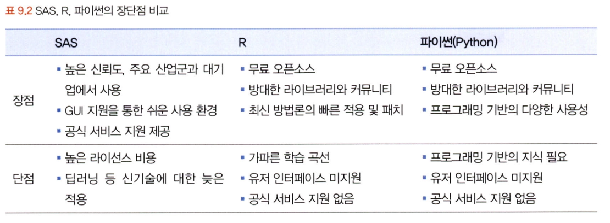
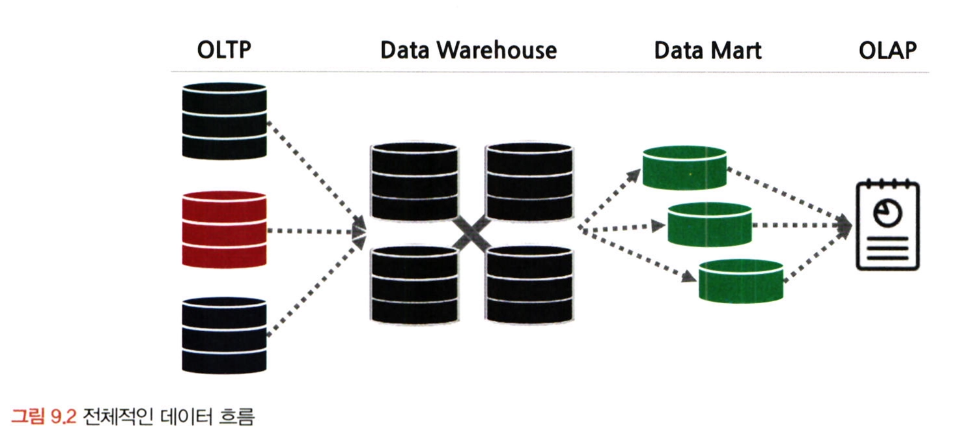
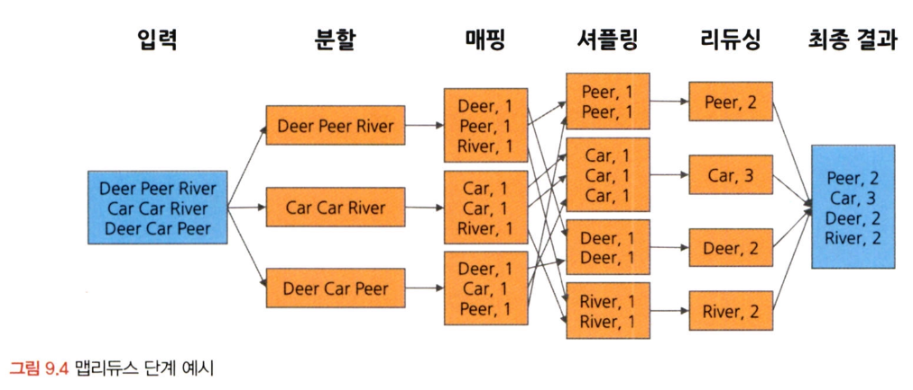
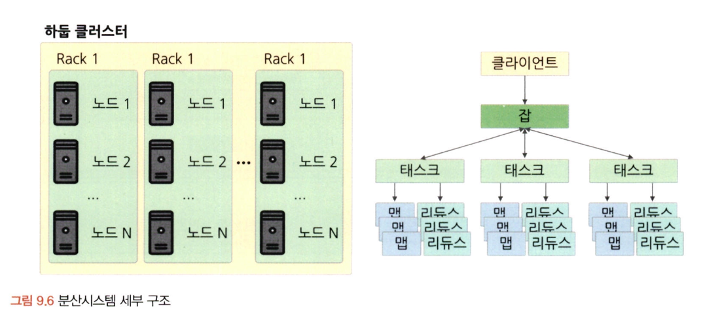

# 통계학 3주차 정규과제

📌통계학 정규과제는 매주 정해진 분량의 『*데이터 분석가가 반드시 알아야 할 모든 것*』 을 읽고 학습하는 것입니다. 이번 주는 아래의 **Statistics_3rd_TIL**에 나열된 분량을 읽고 `학습 목표`에 맞게 공부하시면 됩니다.

아래의 문제를 풀어보며 학습 내용을 점검하세요. 문제를 해결하는 과정에서 개념을 스스로 정리하고, 필요한 경우 추가자료와 교재를 다시 참고하여 보완하는 것이 좋습니다.

2주차는 `2부-데이터 분석 준비하기`를 읽고 새롭게 배운 내용을 정리해주시면 됩니다.


## Statistics_3rd_TIL

### 2부. 데이터 분석 준비하기
### 08. 분석 프로젝트 준비 및 기획
### 09. 분석 환경 세팅하기


## Study Schedule

|주차 | 공부 범위     | 완료 여부 |
|----|----------------|----------|
|1주차| 1부 p.2~56     | ✅      |
|2주차| 1부 p.57~79    | ✅      | 
|3주차| 2부 p.82~120   | ✅      | 
|4주차| 2부 p.121~202  | 🍽️      | 
|5주차| 2부 p.203~254  | 🍽️      | 
|6주차| 3부 p.300~356  | 🍽️      | 
|7주차| 3부 p.357~615  | 🍽️      |  

<!-- 여기까진 그대로 둬 주세요-->

# 08. 분석 프로젝트 준비 및 기획

```
✅ 학습 목표 :
* 데이터 분석 프로세스를 설명할 수 있다.
* 비즈니스 문제를 정의할 때 주의할 점을 설명할 수 있다.
* 외부 데이터를 수집하는 방법에 대해 인식한다.
```
<!-- 새롭게 배운 내용을 자유롭게 정리해주세요.-->
## 8.1. 데이터 분석의 전체 프로세스   
데이터 분석의 궁극적 목표: 의사결정 프로세스 최적화
- **설계 단계**
  - 과제 정의 및 범위 설정
  - 인력 구성 및 PM 확보
  - 실무자 & 데이터 분석가 간 협의 체계 수립
- **분석 및 모델링 단계**
  - 데이터 분석을 위한 데이터 서버 환경 마련
  - 데이터 준비, 가공, 분석 및 모델 도출
  - 모델 검증 및 실무, 경영진 협의   
  - **CRISP-DM 방법론**   
         
  - **SAS SEMMA 방법론**   
         
- **구축 및 활용 단계**
  - 모델 적용 및 시스템 구축
  - 성과 평가 및 추가, 보완 프로젝트 검토

## 8.2. 비즈니스 문제 정의와 분석 목적 도출   
**MECE**: 비즈니스 문제를 올바르게 정의하기 위한 논리적 접근법. 세부 정의들이 서로 겹치지 않고 전체를 합쳤을 때는 빠진 것 없이 완전히 전체를 이루는 것을 의미   
   
> 비즈니스 문제는 현상에 대한 설명으로 끝나서는 안 되고, 본질적인 문제점이 함께 전달되어야 함
**페이오프 매트릭스**: 우선 순위 결정 방식
   
1번 영역 우선 선정, 2번 영역 일부 선정, 나머지 제외

## 8.3. 분석 목적의 전환   
분석 프로젝트를 수행하는 동안 실무자들 간의 **커뮤니케이션 및 협력**이 매우 중요함   

## 8.4. 도메인 지식   
직접 의미 있는 변수를 찾아내고 분석 방향을 설정하는 것은 도메인 지식이 충분하게 수반됐을 때 가능   
데이터가 생성되는 현장을 직접 보고 소비자, 사용자의 입장이 되어 경험을 해보는 것이 좋음   

## 8.5. 외부 데이터 수집과 크롤링   
분석 목적을 명확히 정의 -> 이에 맞는 외부 데이터를 찾고 수집
- **외부 데이터 수집 방법**
  - 데이터 구매
  - 오픈 데이터 수집
  - 크롤링
    ```python
    # 예시 코드
    import requests
    from bs4 import BeautifulSoup

    url = 'https://www.naver.com/'

    response = requests.get(url)

    if response.status_code == 200:
      html = response.text
      soup = BeautifulSoup(html, 'html.parser')
      title = soup.select_one(
        '#NM_THEME_CONTAINER > div:nth-child(1) > div > ul > li:nth-child(3) > a.theme_info > strong')
      print(title)
    else:
      print(response.status_code)

    ```


# 09. 분석 환경 세팅하기

```
✅ 학습 목표 :
* 데이터 분석의 전체적인 프로세스를 설명할 수 있다.
* 테이블 조인의 개념과 종류를 이해하고, 각 조인 방식의 차이를 구분하여 설명할 수 있다.
* ERD의 개념과 역할을 이해하고, 기본 구성 요소와 관계 유형을 설명할 수 있다.
```

<!-- 새롭게 배운 내용을 자유롭게 정리해주세요.-->

## 9.1. 어떤 데이터 분석 언어를 사용하는 것이 좋을까 ?   
SAS, R, python, SQL   
   

## 9.2. 데이터 처리 프로세스 이해하기   
일반적 흐름: OLTP - DW(ODS) - DM - OLAP
  

- **OLTP**: 시간으로 데이터를 트랜잭션 단위로 수집, 분류, 저장하는 시스템   
- **DW(ODS)**: 수집된 데이터를 사용자 관점에서 주제별로 통합하여 쉽게 원하는 데이터를 빼낼 수 있도록 저장해 놓은 통합 데이터베이스   
- **DM**: 사용자의 목적에 맞도록 가공된 일부의 데이터가 저장되는 곳, DW시스템의 부하 감소 가능       
- **ETL**: 저장된 데이터를 사용자가 요구하는 포맷으로 변형하여 이동시키는 작업 과정

## 9.3. 분산 데이터 처리   
분산 데이터 처리: 한 컴퓨터가 처리해야 할 일을 여러 컴퓨터가 나눠서 한 다음 그 결과를 합치는 것
**Scale-up**: 한 대의 컴퓨터 성능을 높여 처리 → 데이터 크기가 커지면 속도 느려짐
**Scale-out**: 여러 대의 컴퓨터로 병렬 분산 처리 → 대용량 데이터에 적합   
- **HDFS**:
  - **슬레이브 노드**: 데이터 저장 및 계산  
  - **마스터 노드**: 대량의 데이터 저장 및 병렬 처리   
  - **클라이언트 머신**: 작업 결과 표시
- **맵리듀스**: 데이터를 key-value 쌍으로 나눠 처리하는 2단계 프로세스  
  - **Map**: 흩어져 있는 데이터를 관련된 데이터끼리 묶어서 임시의 집합을 만드는 과정   
  - **Reduce**: 필터링과 정렬을 거쳐 데이터를 뽑아냄       
     

- **분산시스템 구조**
  
  
## 9.4. 테이블 조인과 정의서 그리고 ERD   


<br>
<br>

# 확인 문제

## 문제 1.

> **🧚 아래의 테이블을 조인한 결과를 출력하였습니다. 어떤 조인 방식을 사용했는지 맞춰보세요.**

> 사용한 테이블은 다음과 같습니다.

|
---|---|

> 보기: INNER, LEFT, RIGHT 조인

<!-- 테이블 조인의 종류를 이해하였는지 확인하기 위한 문제입니다. 각 테이블이 어떤 조인 방식을 이용하였을지 고민해보고 각 테이블 아래에 답을 작성해주세요.-->

### 1-1. 

```
여기에 답을 작성해주세요!
```

### 1-2. 

```
여기에 답을 작성해주세요!
```

### 1-3. 

```
여기에 답을 작성해주세요!
```

### 🎉 수고하셨습니다.
