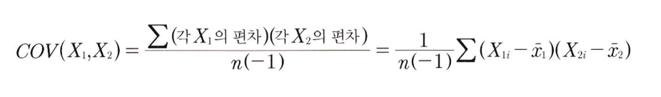
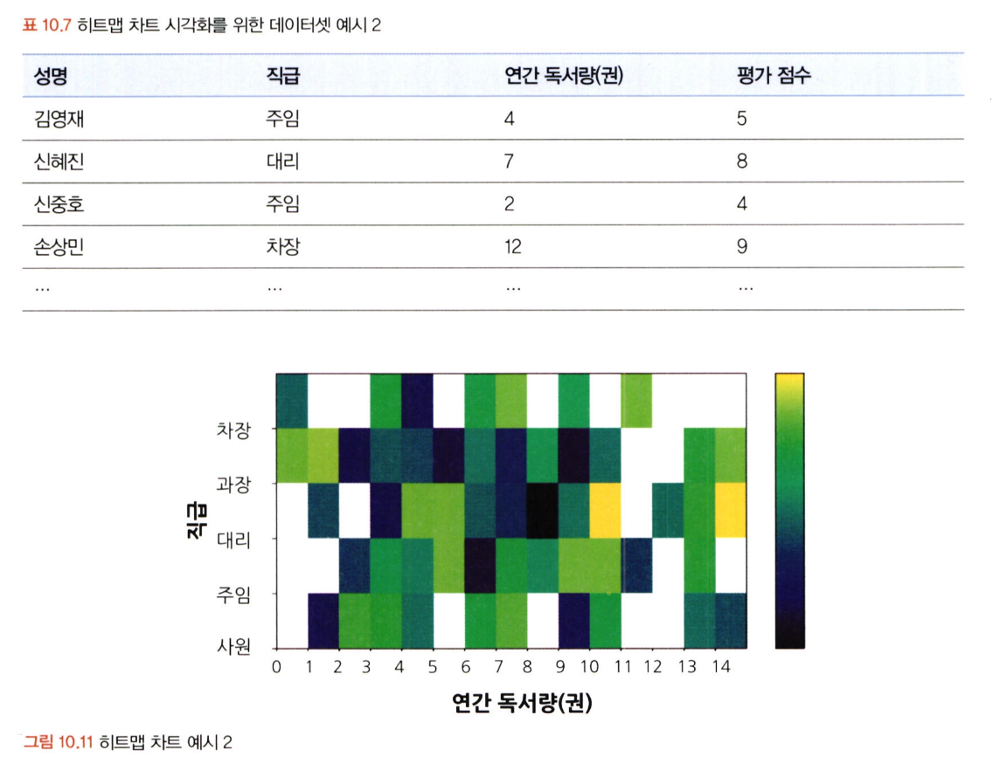
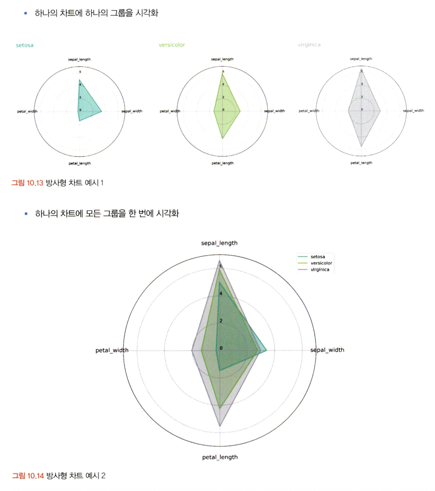
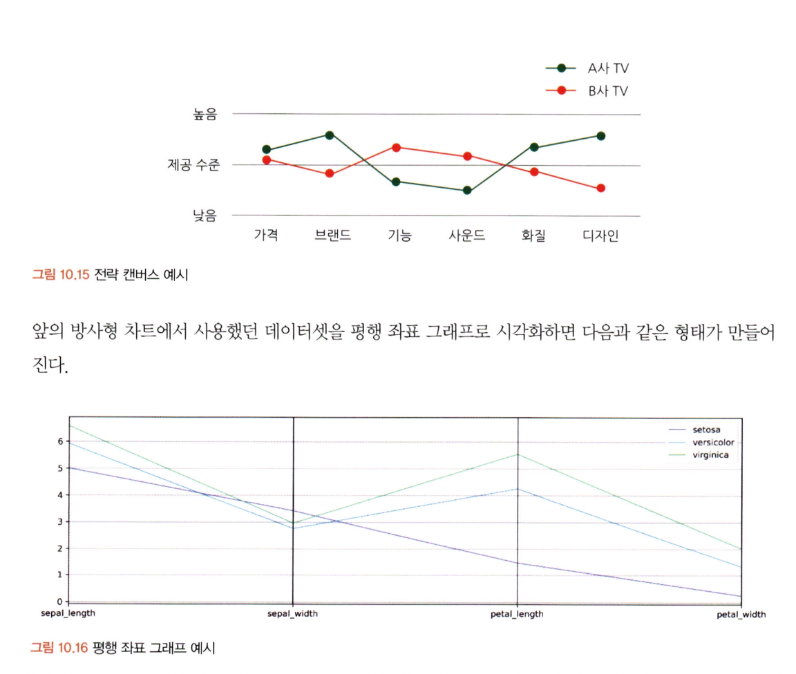
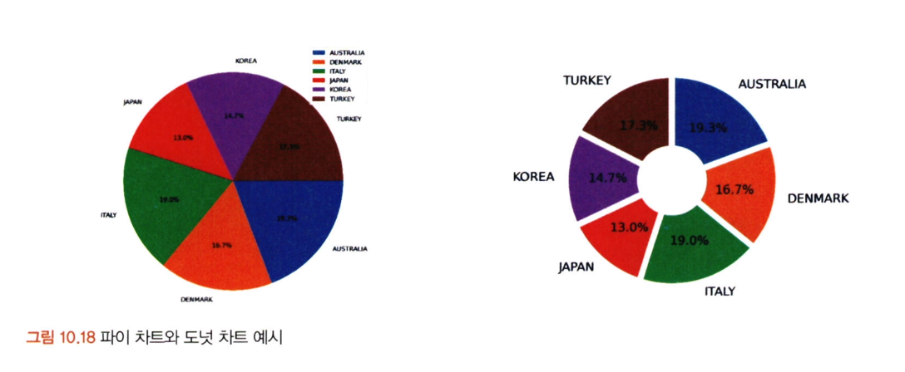
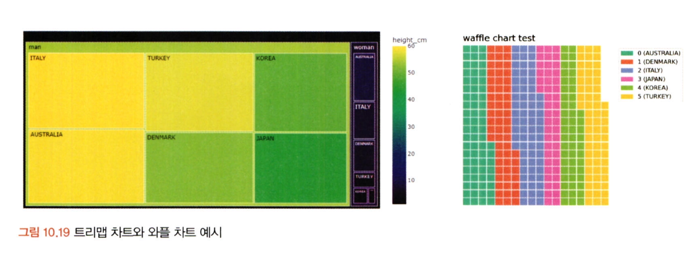
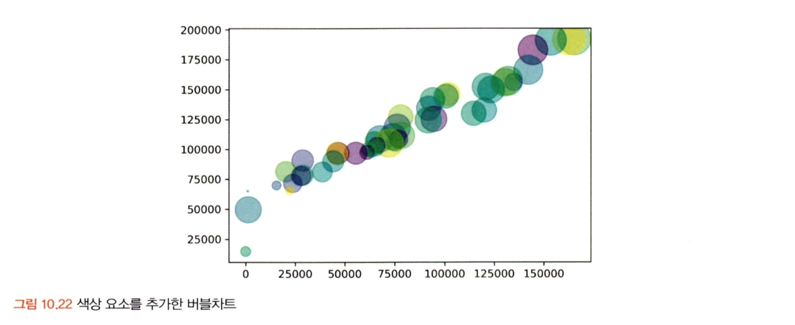
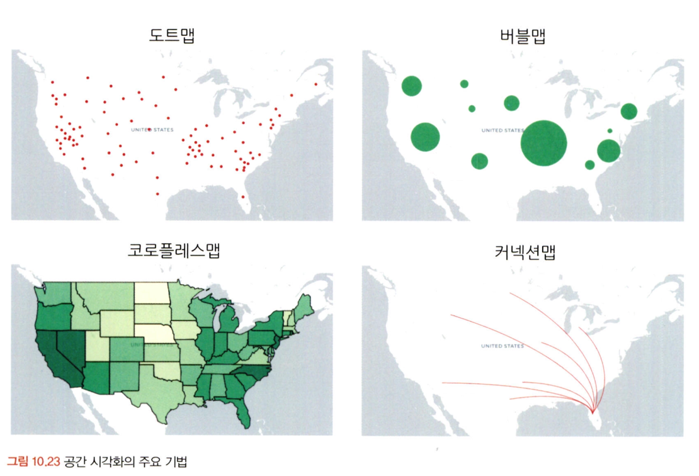
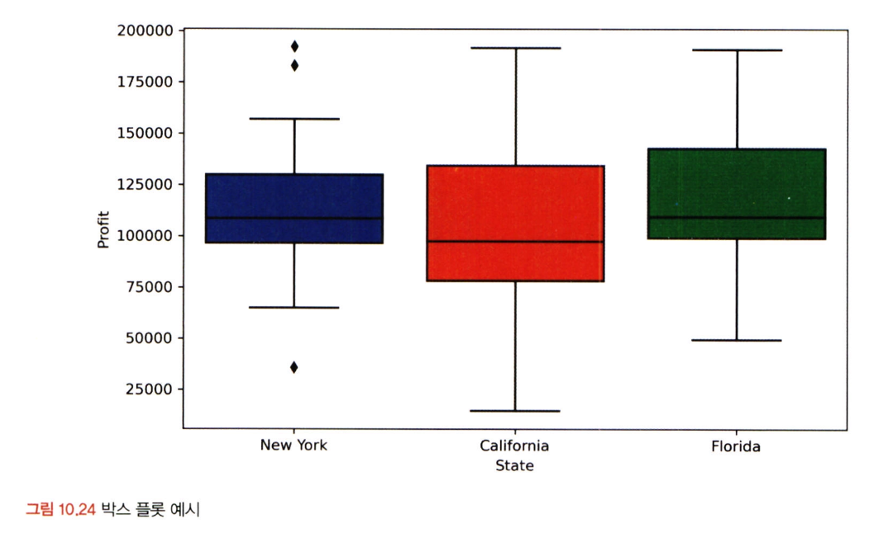
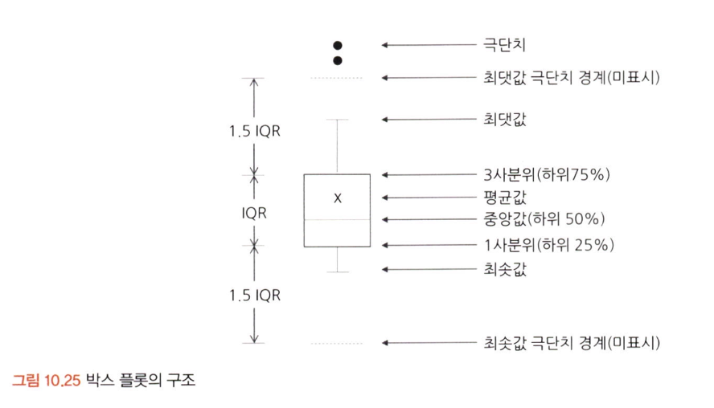

# 통계학 4주차 정규과제

📌통계학 정규과제는 매주 정해진 분량의 『*데이터 분석가가 반드시 알아야 할 모든 것*』 을 읽고 학습하는 것입니다. 이번 주는 아래의 **Statistics_4th_TIL**에 나열된 분량을 읽고 `학습 목표`에 맞게 공부하시면 됩니다.

아래의 문제를 풀어보며 학습 내용을 점검하세요. 문제를 해결하는 과정에서 개념을 스스로 정리하고, 필요한 경우 추가자료와 교재를 다시 참고하여 보완하는 것이 좋습니다.

4주차는 `2부. 데이터 분석 준비하기`를 읽고 새롭게 배운 내용을 정리해주시면 됩니다.


## Statistics_4th_TIL

### 2부. 데이터 분석 준비하기
### 10. 데이터 탐색과 시각화


## Study Schedule

|주차 | 공부 범위     | 완료 여부 |
|----|----------------|----------|
|1주차| 1부 p.2~56     | ✅      |
|2주차| 1부 p.57~79    | ✅      | 
|3주차| 2부 p.82~120   | ✅      | 
|4주차| 2부 p.121~202  | ✅      | 
|5주차| 2부 p.203~254  | 🍽️      | 
|6주차| 3부 p.300~356  | 🍽️      | 
|7주차| 3부 p.357~615  | 🍽️      | 

<!-- 여기까진 그대로 둬 주세요-->

# 10. 데이터 탐색과 시각화

```
✅ 학습 목표 :
* EDA의 목적을 설명할 수 있다.
* 주어진 데이터셋에서 이상치, 누락값, 분포 등을 식별하고 EDA 결과를 바탕으로 데이터셋의 특징을 해석할 수 있다.
* 공분산과 상관계수를 활용하여 두 변수 간의 관계를 해석할 수 있다.
* 적절한 시각화 기법을 선택하여 데이터의 특성을 효과적으로 전달할 수 있다.
```
<!-- 새롭게 배운 내용을 자유롭게 정리해주세요.-->
## 10.1. 탐색적 데이터 분석   
EDA를 하는 주요 목적
- 데이터의 형태와 척도가 분석에 알맞게 되어 있는지 확인 (sanity checking)
- 데이터의 평균, 분산, 분포, 패턴 등의 확인을 통해 데이터 특성 파악
- 데이터의 결측값 및 이상치 파악과 보완
- 변수 간의 관계성 분석
- 분석 목적과 방향성 점검 및 보정

기본 EDA 코드
- read(): 데이터 불러오기
- head(): 데이터 샘플 확인
- info(): 각 칼럼의 속성 및 결측치 확인
- describe(): 각 칼럼의 통계치 확인
- skew(): 각 칼럼의 왜도 확인
- kurtosis(): 각 칼럼의 첨도 확인
- displot(): 특정 변수 분포 시각화
- violinplot(), stripplot(): 특정 변수 분포 차이 시각화

## 10.2. 공분산과 상관성 분석 
상관 분석을 하기 위해서는 데이터가 **등간이나 비율 척도**이며 두 변수가 **선형적 관계**라는 기본 가정을 둠   
공분산 공식
- 

피어슨 상관계수 공식
- 

산점도의 기울기와 상관계수는 관련이 없음   
분산의 관계성이 같다면 기울기에 관련 없이 상관계수는 동일

공분산과 상관성 실습 코드
- cov(): 공분산 확인
- corr(): 피어슨 상관계수 확인
- heatmap(): 히트맵 시각화
- clustermap(): 클러스터 히트맵 시각화

## 10.3. 시간 시각화
선 그래프: 시간 간격의 밀도가 높을 때 사용
누적 막대 그래프: 한 시점에 2개 이상의 세부 항목이 존재할 때 사용

시간 시각화 실습 코드
- plot(): 선 그래프 시각화
- plot.bar(): 막대 그래프 시각화
- groupby(): 그룹별 데이터 가공
- clustermap(): 클러스터 히트맵 시각화

## 10.4. 비교 시각화
히트맵: 그룹과 비교 요소가 많을 때 효과적으로 시각화를 할 수 있는 방법
- 히트맵 차트
  - 
- 방사형 차트
  - 
- 평행 좌표 그래프
  - 

## 10.5. 분포 시각화
- 연속형: 양적 척도
  - 막대그래프, 선 그래프, 히스토그램  
- 명목형: 질적 척도
  - (구성요소 간단)파이차트, 도넛차트, (구성요소 복잡)트리맵차트, 와플차트
  - 
  - 

## 10.6. 관계 시각화
버블차트: 세 가지 요소의 상관 관계 표현 가능, 원의 지름이 아닌 면적을 통해 크기를 판단하도록 주의
(지름 두배 == 실제 크기는 네배)
- 

## 10.7. 공간 시각화
공간 시각화는 거시적에서 미시적으로 진행되는 분석 방향과 같이 **스토리라인을 잡고 시각화를 적용**하는 것이 좋다.
- 

## 10.8. 박스 플롯
박스 플롯은 하나의 그림으로 양적 척도 데이터의 분포 및 편향석, 평균과 중앙값 등 다양한 수치를 보기 쉽게 정리해 줌.
박스플롯의 다섯 가지 수치
- 1. 최솟값: 제1사분위수에서 1.5 IQR을 뺀 위치
- 2. 제1사분위수(Q1): 전체 데이터 중 하위 25%에 해당하는 위치
- 3. 제2사분위수(Q2): 전체 데이터 중 50%에 해당하는 위치로, **중앙값(median)**을 의미함
- 4. 제3사분위수(Q3): 전체 데이터 중 상위 75%에 해당하는 위치
- 5. 최댓값: 제3사분위수에서 1.5 IQR을 더한 위치
- 
- 

<br>
<br>

# 확인 문제

## 문제 1.
> **🧚 공분산과 상관계수의 차이점에 대해 간단히 설명하세요.**

```
공분산과 상관계수 모두 각 변수의 변동이 얼마나 닮았는지를 표현한다는 점에서 같지만

공분산은 서로 공유하는 분산을 나타내어 변수 간의 상관관계를 수치화한 것이고
상관계수는 두 변수의 선형 관계를 측정한 값으로 두 변수간의 직접적인 상관성의 정도를 나타낸다(-1~1사이의 값).
```

## 문제 2.
> **🧚 다음 데이터 분석 목표에 적합한 시각화 방법을 보기에서 모두 골라 연결해주세요.**

> 보기: 산점도, 선그래프, 막대그래프, 히스토그램, 박스플롯

(a) 변수의 분포 확인   
(b) 두 변수 간의 관계 확인   
(c) 집단별 평균 비교   
(d) 시계열 데이터 분석

<!--중복 가능-->

```
(a) 변수의 분포 확인: 히스토그램, 박스플롯   
(b) 두 변수 간의 관계 확인: 산점도   
(c) 집단별 평균 비교: 박스플롯   
(d) 시계열 데이터 분석: 선그래프, 막대그래프
```


### 🎉 수고하셨습니다.
