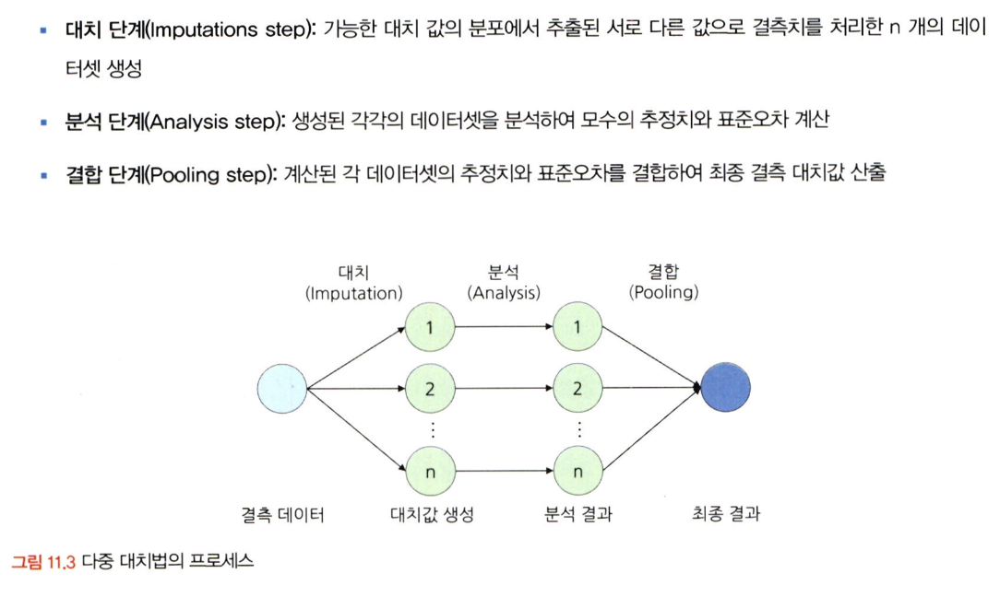
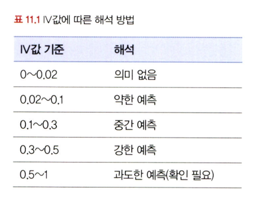
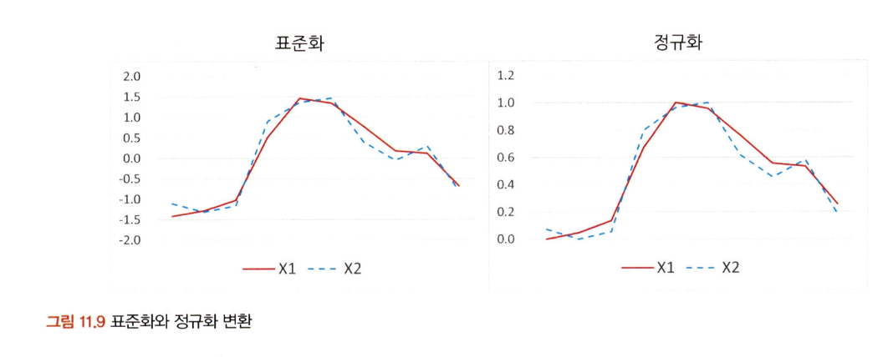
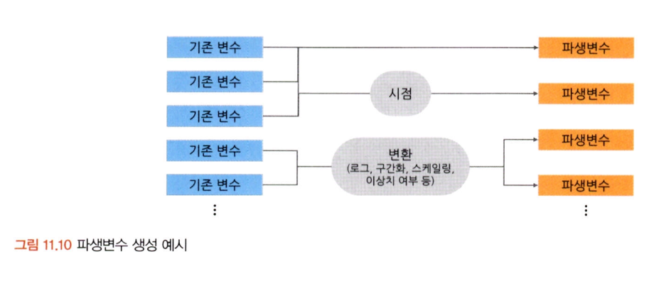

# 통계학 5주차 정규과제

📌통계학 정규과제는 매주 정해진 분량의 『*데이터 분석가가 반드시 알아야 할 모든 것*』 을 읽고 학습하는 것입니다. 이번 주는 아래의 **Statistics_5th_TIL**에 나열된 분량을 읽고 `학습 목표`에 맞게 공부하시면 됩니다.

아래의 문제를 풀어보며 학습 내용을 점검하세요. 문제를 해결하는 과정에서 개념을 스스로 정리하고, 필요한 경우 추가자료와 교재를 다시 참고하여 보완하는 것이 좋습니다.

5주차는 `2부. 데이터 분석 준비하기`를 읽고 새롭게 배운 내용을 정리해주시면 됩니다.


## Statistics_5th_TIL

### 2부. 데이터 분석 준비하기
### 11.데이터 전처리와 파생변수 생성


## Study Schedule

|주차 | 공부 범위     | 완료 여부 |
|----|----------------|----------|
|1주차| 1부 p.2~56     | ✅      |
|2주차| 1부 p.57~79    | ✅      | 
|3주차| 2부 p.82~120   | ✅      | 
|4주차| 2부 p.121~202  | ✅      | 
|5주차| 2부 p.203~254  | ✅      | 
|6주차| 3부 p.300~356  | 🍽️      | 
|7주차| 3부 p.357~615  | 🍽️      | 

<!-- 여기까진 그대로 둬 주세요-->

# 11.데이터 전처리와 파생변수 생성

```
✅ 학습 목표 :
* 결측값과 이상치를 식별하고 적절한 방법으로 처리할 수 있다.
* 데이터 변환과 가공 기법을 학습하고 활용할 수 있다.
* 모델 성능 향상을 위한 파생 변수를 생성하고 활용할 수 있다.
```


## 11.1. 결측값 처리
<!-- 새롭게 배운 내용을 자유롭게 정리해주세요. -->

* 실제 분석에서 결측값(missing value)은 흔히 존재
* 분석 전 **결측 원인과 패턴**을 이해하는 것이 중요
* 결측값이 **무작위로 발생했는지**, 특정 변수나 그룹에 **편향되어 발생**했는지에 따라 처리 방법이 달라짐

결측값의 종류 (결측 메커니즘)

* MCAR (Missing Completely at Random): 완전히 무작위 → 분석에 덜 영향을 줌
* MAR (Missing At Random): 다른 변수에 조건부로 무작위 → 통계 모델 보정 가능
* MNAR (Missing Not At Random): 결측 자체에 체계적 이유가 있음 → 보정 어려움

결측값 처리 방법
* 회귀 대체: 결측값을 가진 변수를 종속 변수로 설정하고, 나머지 변수들을 독립 변수로 사용하여 회귀식을 만든 뒤, 그 회귀식을 통해 결측값을 예측하여 대치하는 방법
    * 결측된 변수의 분산 과소 추정 문제 있음 
* 다중 대체: 단순 대치를 여러 번 수행하여 n개의 가상 데이터셋을 생성하고, 이들의 평균을 사용하여 결측값을 대치하는 방법
     

## 11.2. 이상치 처리
<!-- 새롭게 배운 내용을 자유롭게 정리해주세요. -->
이상치:
* 일반적인 데이터 패턴에서 **크게 벗어나는 극단적인 값**
* 평균은 이상치에 민감하게 영향을 받기 때문에,이상치가 존재하는 경우에는 평균보다 **중위수**와 **중위수 절대 편차**(MAD: Median Absolute Deviation)를 사용하는 것이 더 효과적

## 11.3. 변수 구간화
<!-- 새롭게 배운 내용을 자유롭게 정리해주세요. -->
구간화:
* **이산형 변수 → 범주형 변수**로 변환

- WOE, IV로 변수값이 효과적으로 구간화 되었는지 확인 가능
    


## 11.4. 데이터 표준화와 정규화 스케일링
<!-- 새롭게 배운 내용을 자유롭게 정리해주세요. -->

표준화:
* 각 관측치의 값이 전체 평균을 기준으로 어느정도 떨어져있는가

정규화 (Normalization)
* 데이터 범위를 0~1 사이로 변환



RobustScaler
* 데이터의 중앙값(Q2)을 기준으로 0으로 맞추고, 1사분위수(Q1)와 3사분위수(Q3) 사이의 범위인 IQR을 1이 되도록 변환하는 스케일링 기법
* 이상치 영향 최소화

## 11.5. 모델 성능 향상을 위한 파생 변수 생성
<!-- 새롭게 배운 내용을 자유롭게 정리해주세요. -->
파생 변수:
* 기존 변수들을 조합하거나 함수를 통해 새로 만든 변수
  
* 데이터 특성 이용하여 분석 효율을 높이는 것 이므로 데이터 및 도메인에 대한 충분한 이해 필요
* **다중공산성** 발생 확률이 높으므로 파생변수 생성 후에는 **상관분석**을 통해 변수간 상관성을 확인해야함

<br>
<br>

# 확인 문제

## 문제 1. 데이터 전처리

> **🧚 한 금융회사의 대출 데이터에서 `소득` 변수에 결측치가 포함되어 있다. 다음 중 가장 적절한 결측치 처리 방법은 무엇인가?**

> **[보기]   
1️⃣ 결측값이 포함된 행을 모두 제거한다.  
2️⃣ 결측값을 `소득` 변수의 평균값으로 대체한다.  
3️⃣ `연령`과 `직업군`을 독립변수로 사용하여 회귀 모델을 만들어 `소득` 값을 예측한다.  
4️⃣ 결측값을 보간법을 이용해 채운다.**

> **[데이터 특징]**     
    - `소득` 변수는 연속형 변수이다.  
    - 소득과 `연령`, `직업군` 간에 강한 상관관계가 있다.  
    - 데이터셋에서 `소득` 변수의 결측 비율은 15%이다.

```
3️⃣ 강한 상관 관계가 있으므로 결측값을 예측하고 변수 간 관계 유지 가능
```

## 문제 2. 데이터 스케일링

> **🧚 머신러닝 모델을 학습하는 과정에서, `연봉(단위: 원)`과 `근속연수(단위: 년)`를 동시에 독립변수로 사용해야 합니다. 연봉과 근속연수를 같은 스케일로 맞추기 위해 어떤 스케일링 기법을 적용하는 것이 더 적절한가요?**

<!--표준화와 정규화의 차이점에 대해 고민해보세요.-->

```
표준화. 근속 연수와 연봉은 단위 차이가 너무 크기 때문이다. 
```

### 🎉 수고하셨습니다.
