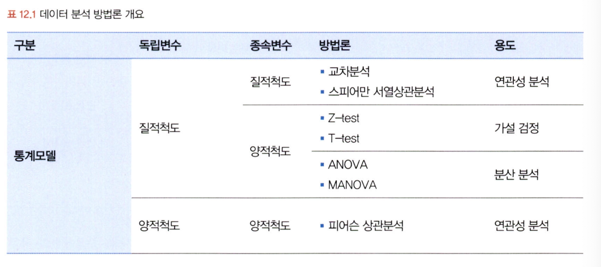
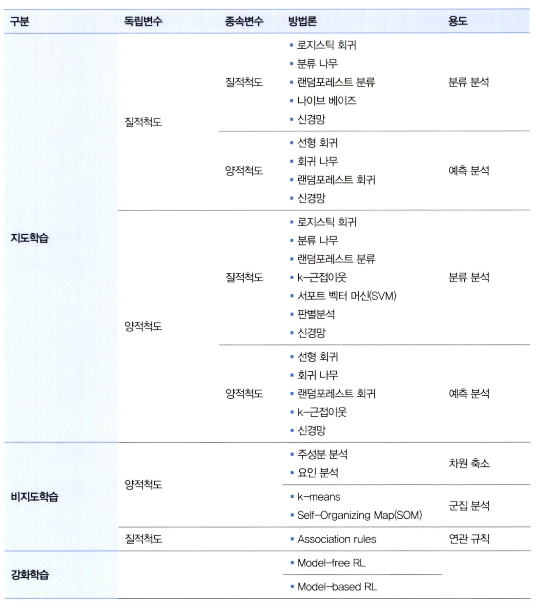
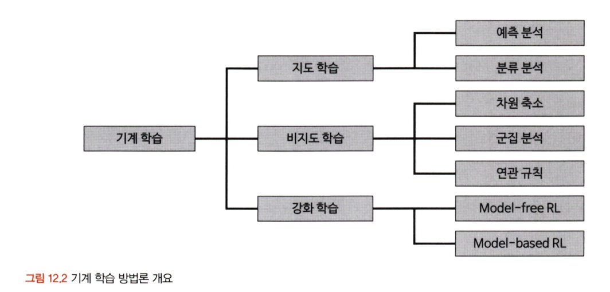
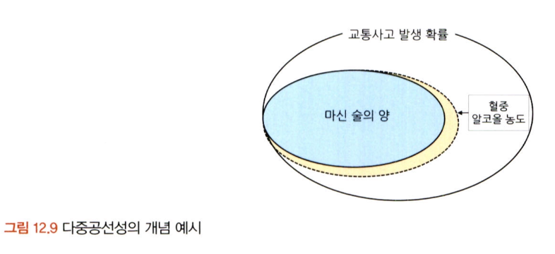
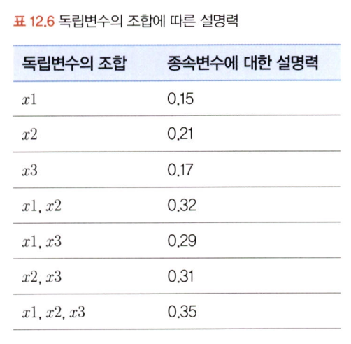
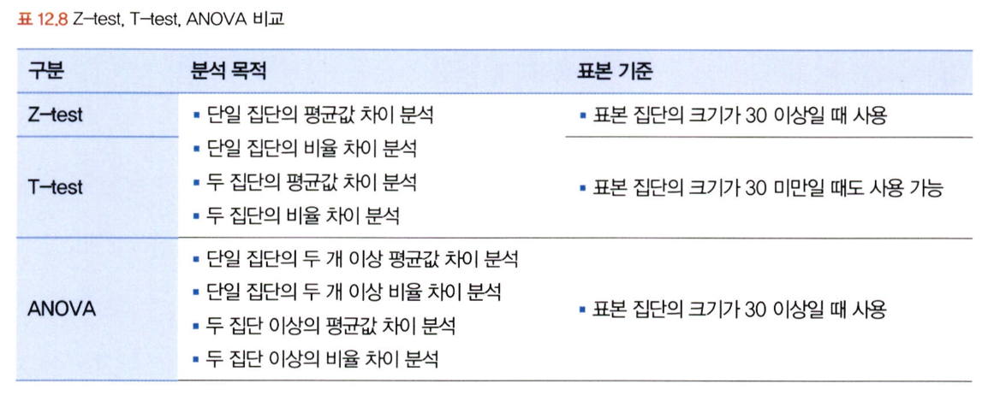
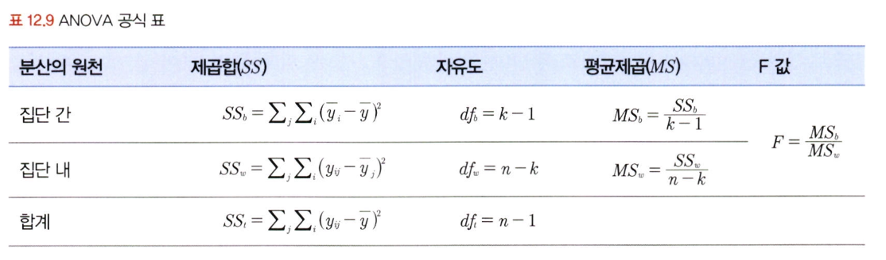

# 통계학 6주차 정규과제

📌통계학 정규과제는 매주 정해진 분량의 『*데이터 분석가가 반드시 알아야 할 모든 것*』 을 읽고 학습하는 것입니다. 이번 주는 아래의 **Statistics_6th_TIL**에 나열된 분량을 읽고 `학습 목표`에 맞게 공부하시면 됩니다.

아래의 문제를 풀어보며 학습 내용을 점검하세요. 문제를 해결하는 과정에서 개념을 스스로 정리하고, 필요한 경우 추가자료와 교재를 다시 참고하여 보완하는 것이 좋습니다.

6주차는 `3부. 데이터 분석하기`를 읽고 새롭게 배운 내용을 정리해주시면 됩니다.


## Statistics_6th_TIL

### 3부. 데이터 분석하기
### 12.통계 기반 분석 방법론


## Study Schedule

|주차 | 공부 범위     | 완료 여부 |
|----|----------------|----------|
|1주차| 1부 p.2~56     | ✅      |
|2주차| 1부 p.57~79    | ✅      | 
|3주차| 2부 p.82~120   | ✅      | 
|4주차| 2부 p.121~202  | ✅      | 
|5주차| 2부 p.203~254  | ✅      | 
|6주차| 3부 p.300~356  | ✅      | 
|7주차| 3부 p.357~615  | 🍽️      |

<!-- 여기까진 그대로 둬 주세요-->

# 12.통계 기반 분석 방법론

```
✅ 학습 목표 :
* 주성분 분석(PCA)의 개념을 설명할 수 있다.
* 다중공선성을 진단할 수 있다.
* Z-TEST와 T-TEST의 개념을 비교하고, 적절한 상황에서 검정을 설계하고 수행할 수 있다.
* ANOVA TEST를 활용하여 세 개 이상의 그룹 간 평균 차이를 검정하고, 사후검정을 수행할 수 있다.
* 카이제곱 검정을 통해 범주형 변수 간의 독립성과 연관성을 분석하는 방법을 설명할 수 있다.
```

## 12.1. 분석 모델 개요
<!-- 새롭게 배운 내용을 자유롭게 정리해주세요.-->   
통계 모델: 모형과 해석 중요, 오차와 불확정성 강조   
기계 학습: 예측 정확도 강조      
   
   
변수의 속성과 종속변수 유무에 따라 **지도학습, 비지도학습, 강화학습**으로도 나뉘고
질적, 양적 척도에 따라 사용되는 기법도 달라짐   
    


## 12.2. 주성분 분석(PCA)
<!-- 새롭게 배운 내용을 자유롭게 정리해주세요.-->
여러 개의 독립변수들에서 핵심적인 성분만 추출하여 데이터의 차원을 축소하는 기법   
- 독립변수(차원)의 수를 줄이고 분석 모델을 간단하게 만들 수 있다.   
- 많은 수의 변수를 소수의 핵심 변수로 압축함으로써 분석의 효율성과 해석력을 높일 수 있다.

주성분 분석을 적용하기 위해서는 필요한 조건   
- 사용되는 변수들은 등간 척도 또는 비율 척도로 측정된 양적 변수
- 관측치들은 서로 독립적
- 전체 데이터는 정규분포를 따른다는 가정을 만족

차원을 감소하는 방법
- 변수 선택을 통해 비교적 불필요하거나 유의성이 낮은 변수 제거
- 변수들의 잠재적인 성분을 추출하여 차원을 줄임 (공통요인분석이 여기 속함)

## 12.4. 다중공선성 해결과 섀플리 밸류 분석
<!-- 새롭게 배운 내용을 자유롭게 정리해주세요.-->
두 개 이상의 독립변수 간 상관관계가 매우 높아 서로 선형적인 관계를 가지는 현상

- 첫 번째 독립변수: 종속변수를 설명
- 두 번째 독립변수: 그 잔여 변량을 설명하는 구조   
  → 다중공선성이 있으면, 첫 번째와 두 번째 변수의 설명력이 겹쳐서 두 번째 변수가 추가로 설명할 수 있는 정보가 거의 사라지게 됨
  
다중공선성 판단 기준   

| 기준                 | 설명                                                     |
| ------------------ | ------------------------------------------------------ |
| **상관계수 분석**        | 독립변수 간 상관계수의 절댓값이 **0.7 이상**이면 다중공선성 의심                |
| **결정계수(R²) vs t값** | R²는 높은데 회귀계수의 t값이 낮으면, 다중공선성 가능성 있음                    |
| **t값 기준**          | t값이 클수록 설명력(신호)이 높고, 표준오차(노이즈) 대비 신뢰 높음                |
|                    | 관측치가 충분하다면 t값 **≥ 1.96**이면 통계적으로 유의하다고 봄 (95% 신뢰수준 기준) |

다중공산성 해결 방법
- VIF 값이 높으면서 종속 변수와의 상관성(설명력)이 낮은 변수 제거
- 표본 관측치를 추가적으로 확보
- 로그, 표준화 등을 통한 변수 가공
- 주성분 분석을 통한 변수 축약
- 변수 선택 알고리즘을 활용하여 적정 변수 자동 선정

새플리 밸류: 각 독립변수가 종속변수의 설명력에 기여하는 정도를 공정하게 분배하는 방식
- 변수들이 혼자 또는 조합으로 모델에 얼마나 기여하는지 정량적으로 보여줌
- 단순한 회귀계수 해석보다 공정하고 직관적인 설명력 기반 해석을 가능하게 해줌
- 변수 선택 시 기준값으로도 활용 가능   


## 12.6. Z-test와 T-test
<!-- 새롭게 배운 내용을 자유롭게 정리해주세요.-->
### Z-test vs T-test   
Z-test는 모집단 분산을 아는 경우 사용. 하지만 실무에서는 모집단 분산을 아는 경우는 드물다   
중심극한정리에 의해 표본 수가 30 이상이면 정규성을 가정하고 Z-test 사용 가능   
그러나 일반적으로는 T-test를 더 널리 사용하며, n ≥ 30일 때도 T-test 사용 가능   
-> 보통은 T-test를 기본으로 생각해도 무방   
   
Z-test나 T-test를 적용하기 전에 두 집단이 등분산성을 만족하는지 확인해야 함

### 관련 수식

#### 단일 집단 평균 차이에 대한 T-test

**목적**: 한 집단에서 조치 전과 후 평균 차이가 유의미한지를 검정

**공식**:

```math
t_{stat} = \frac{\bar{X} - \mu}{S_X / \sqrt{n}}
```

* $\bar{X}$: 실측 평균 (예: 마케팅 적용 후의 매출 평균)
* $\mu$: 귀무가설 하의 평균값 (예: 적용 전 매출 평균)
* $S_X$: 표본의 표준 편차
* $n$: 표본 수

#### 단일 집단 비율 차이에 대한 T-test

**목적**: 한 집단의 실제 비율이 기대 비율과 유의미하게 다른지 검정

**공식**:

```math
t_{stat} = \frac{p - \pi}{\sqrt{\pi (1 - \pi) / n}}
```

* $p$: 표본의 관측 비율
* $\pi$: 모집단의 기대 비율
* $n$: 표본 크기

#### 두 집단 평균 차이에 대한 T-test

**목적**: 두 집단 간 평균 차이가 유의미한지 검정

**공식**:

```math
t_{stat} = \frac{\bar{X}_A - \bar{X}_B - (\mu_A - \mu_B)}{\sqrt{S_A^2 / n_A + S_B^2 / n_B}}
```

* $\bar{X}_A$, $\bar{X}_B$: A, B 집단의 평균
* $\mu_A - \mu_B$: 두 집단 간 기대 평균 차이 (보통 0)
* $S_A^2$, $S_B^2$: 각 집단의 분산
* $n_A$, $n_B$: 각 집단의 표본 수

#### 단일 집단 비율 차이에 대한 T-test

**공식**:

```math
t_{stat} = \frac{p - \pi}{\sqrt{\pi (1 - \pi) / n}}
```

* $p$: 표본 비율
* $\pi$: 기대 비율
* $n$: 표본 수


#### 두 집단 비율 차이에 대한 T-test

**공식**:

```math
t_{stat} = \frac{(p_A - p_B) - (\pi_A - \pi_B)}{\sqrt{\frac{p_A(1 - p_A)}{n_A} + \frac{p_B(1 - p_B)}{n_B}}}
```

* $p_A$, $p_B$: A, B 집단의 비율
* $\pi_A$, $\pi_B$: 기대 비율 차이 (보통 0)
* $n_A$, $n_B$: 각 집단의 표본 수


## 12.7. ANOVA
<!-- 새롭게 배운 내용을 자유롭게 정리해주세요.-->
3개 이상 집단 평균 차이 검정할 땐 T-test 대신 ANOVA

- 집단 간 분산 / 집단 내 분산 비교 → F-값 계산
- 유의미한 차이 있을 땐 사후 검정(Tukey, Scheffe 등)으로 어떤 집단 간 차이인지 확인


## 12.8. 카이제곱 검정(교차분석)
<!-- 새롭게 배운 내용을 자유롭게 정리해주세요.-->
교차분석이라고도 불리며 범주형 변수 간 연관성 확인할 때 사용

- 교차표 → 기대빈도 계산 → 관측값과 차이 → χ² 값 도출
- p값 < 0.05면 두 변수 간 상관성 있음

<br>
<br>

# 확인 문제

### **문제 1.**
> **🧚 경희는 다트비 교육 연구소의 연구원이다. 경희는 이번에 새롭게 개발한 교육 프로그램이 기존 프로그램보다 학습 성취도 향상에 효과적인지 검증하고자 100명의 학생을 무작위로 두 그룹으로 나누어 한 그룹(A)은 새로운 교육 프로그램을, 다른 그룹(B)은 기존 교육 프로그램을 수강하도록 하였다. 실험을 시작하기 전, 두 그룹(A, B)의 초기 시험 점수 평균을 비교한 결과, 유의미한 차이가 없었다. 8주 후, 학생들의 최종 시험 점수를 수집하여 두 그룹 간 평균 점수를 비교하려고 한다.**   

> **🔍 Q1. 이 실험에서 사용할 적절한 검정 방법은 무엇인가요?**

```
독립표본 t-test
```

> **🔍 Q2. 이 실험에서 설정해야 할 귀무가설과 대립가설을 각각 작성하세요.**

```
귀무가설(H0): 그룹A와 그룹B의 평균 점수에 차이가 없다.
대립가설(H1): 그룹A와 그룹B의 평균 점수에 차이가 있다.
```

> **🔍 Q3. 검정을 수행하기 위한 절차를 순서대로 서술하세요.**

<!--P.337의 실습 코드 흐름을 확인하여 데이터를 불러온 후부터 어떤 절차로 검정을 수행해야 하는지 고민해보세요.-->

```
데이터 샘플 확인          → 데이터 로드 후 형태, 결측치 등 기본 구조 확인  
통계값 확인               → 평균, 표준편차 등 기초 통계량으로 그룹 차이 개략 파악  
그룹별 시각화             → boxplot 등으로 분포, 이상치, 그룹 간 차이 시각 확인  
데이터 정규성 검정         → 정규분포 여부 확인   
데이터 등분산성 검정       → 분산이 같은지 확인   
Z-test 수행               → 모집단 분산을 알고 있거나 n≥30일 때 평균 차이 검정  
대응표본 t검정 수행        → 동일 집단 내 사전-사후 평균 비교  
독립표본 t검정 수행        → 두 집단 간 평균 차이 비교  
```

> **🔍 Q4. 이 검정을 수행할 때 가정해야 하는 통계적 조건을 설명하세요.**

```
- 그룹A와 그룹B는 독립
- 그룹A와 그룹B의 시험 점수는 정규분포
- 그룹A와 그룹B의 시험점수는 등분산
```

> **🔍 Q5. 추가적으로 최신 AI 기반 교육 프로그램(C)도 도입하여 기존 프로그램(B) 및 새로운 프로그램(A)과 비교하여 성취도 차이가 있는지 평가하고자 한다면 어떤 검정 방법을 사용해야 하나요? 단, 실험을 시작하기 전, C 그룹의 초기 점수 평균도 A, B 그룹과 유의미한 차이가 없었다고 가정한다.**

```
그룹이 3개 이상이므로 ANOVA를 사용한다
```

> **🔍 Q6. 5번에서 답한 검정을 수행한 결과, 유의미한 차이가 나타났다면 추가적으로 어떤 검정을 수행해 볼 수 있을까요?**

```
사후검정을 통해 어느 집단 간에 통계적으로 유의한 차이가 존재하는지 구체적으로 확인할 수 있다
```

---

### **문제 2. 카이제곱 검정**  
> **🧚 다음 중 어떠한 경우에 카이제곱 검정을 사용해야 하나요?   
1️⃣ 제품 A, B, C의 평균 매출 차이를 비교하고자 한다.  
2️⃣ 남성과 여성의 신체 건강 점수 평균 차이를 분석한다.  
3️⃣ 제품 구매 여부(구매/미구매)와 고객의 연령대(10대, 20대, 30대…) 간의 연관성을 분석한다.  
4️⃣ 특정 치료법이 환자의 혈압을 감소시키는 효과가 있는지 확인한다.**  

```
3️⃣ 제품 구매 여부(구매/미구매)와 고객의 연령대(10대, 20대, 30대…) 간의 연관성을 분석한다.  
```

### 🎉 수고하셨습니다.
