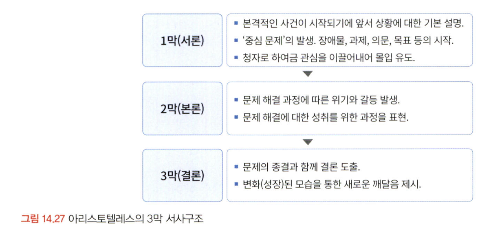

# 통계학 7주차 정규과제

📌통계학 정규과제는 매주 정해진 분량의 『*데이터 분석가가 반드시 알아야 할 모든 것*』 을 읽고 학습하는 것입니다. 이번 주는 아래의 **Statistics_7th_TIL**에 나열된 분량을 읽고 `학습 목표`에 맞게 공부하시면 됩니다.

아래의 문제를 풀어보며 학습 내용을 점검하세요. 문제를 해결하는 과정에서 개념을 스스로 정리하고, 필요한 경우 추가자료와 교재를 다시 참고하여 보완하는 것이 좋습니다.

7주차는 `3부. 데이터 분석하기`를 읽고 새롭게 배운 내용을 정리해주시면 됩니다.


## Statistics_7th_TIL

### 3부. 데이터 분석하기
### 13.머신러닝 분석 방법론
### 14.모델 평가


## Study Schedule

|주차 | 공부 범위     | 완료 여부 |
|----|----------------|----------|
|1주차| 1부 p.2~56     | ✅      |
|2주차| 1부 p.57~79    | ✅      | 
|3주차| 2부 p.82~120   | ✅      | 
|4주차| 2부 p.121~202  | ✅      | 
|5주차| 2부 p.203~254  | ✅      | 
|6주차| 3부 p.300~356  | ✅      | 
|7주차| 3부 p.357~615  | ✅      | 

<!-- 여기까진 그대로 둬 주세요-->

# 13.머신러닝 분석 방법론

```
✅ 학습 목표 :
* 선형 회귀와 다항 회귀를 비교하고, 데이터를 활용하여 적절한 회귀 모델을 구축할 수 있다. 
* 로지스틱 회귀 분석의 개념과 오즈(Odds)의 의미를 설명하고, 분류 문제에 적용할 수 있다.
* k-means 알고리즘의 원리를 설명하고, 적절한 군집 개수를 결정하여 데이터를 군집화할 수 있다.
```

## 13.1. 선형 회귀분석과 Elastic Net(예측모델)
<!-- 새롭게 배운 내용을 자유롭게 정리해주세요.-->
<!-- `13.1.3. Ridge와 Lasso 그리고 Elastic Net` 부분은 제외하고 학습하셔도 무방합니다.-->
회귀선: 두 변수 간의 관계를 설명하는 직선으로, 예측에 사용됨

- 독립변수(X): 예측에 사용되는 변수
- 종속변수(Y): 예측 대상 변수
- 독립변수가 한 개면 단순 회귀, 여러 개면 다중 회귀

오차 최소화 기준: 최소제곱법
- 데이터와 회귀선 간의 수직 거리 제곱의 합(오차 제곱합)을 최소화하는 것이 목표
  또는 최대우도법으로도 설명 가능

다중공선성 문제
- 독립변수들 간에 강한 상관관계가 있으면 회귀 계수 추정이 불안정해짐
- 이를 확인하는 대표 지표: VIF
  - VIF > 10이면 다중공선성 높음

회귀계수 해석:
- Parameter Estimate: 각 변수의 회귀계수 (기울기)
- T-value: 각 회귀계수의 통계적 유의성 검정
- P-value: 계수의 유의성 판단 기준 (일반적으로 0.05 미만이면 유의)

변수 선택 방법
- 전진 선택법:	가장 영향력 큰 변수부터 하나씩 추가
- 후진 제거법:	유의하지 않은 변수부터 제거
- 단계적 선택법: 전진과 후진을 병행하며 변수 선택 최적화

## 13.2. 로지스틱 회귀분석 (분류모델)
<!-- 새롭게 배운 내용을 자유롭게 정리해주세요.-->
로지스틱 회귀
- 종속변수가 범주형일 때 사용하는 회귀 기법
- 선형 회귀처럼 예측값을 단순히 연속값으로 출력하는 것이 아니라 사건이 일어날 확률을 예측
- 결과는 0~1 사이의 확률로 나타내며, 시그모이드 함수(임계값을 기준으로 0 또는 1로 분류)를 통해 출력됨


오즈: 사건이 발생할 확률 대 비발생 확률 비율

  $$
  \text{Odds} = \frac{P(\text{event})}{1 - P(\text{event})}
  $$

로짓: 오즈의 자연 로그

  $$
  \text{Logit}(P) = \log\left(\frac{P}{1 - P}\right)
  $$

Parameter Estimate: 회귀계수 (양수면 확률 증가, 음수면 감소)
Pr > ChiSq: 유의확률 (0.05 미만이면 통계적으로 유의함)

정확도 이외의 모델 성능 평가 지표
- ROC Curve
- Confusion Matrix
- 정분류율/오분류율
- 별지수(Coefficient of Discrimination)

## 13.8. k-means 클러스터링(군집모델)
<!-- 새롭게 배운 내용을 자유롭게 정리해주세요.-->
k-means 클러스터링: 분류와는 달리 정답(label) 없이 데이터의 유사성만으로 그룹을 형성, 유클리드 거리를 기준으로 각 포인트의 중심점과의 거리를 계산

클러스터링 과정
- 1단계: k개의 중심점을 임의의 데이터 공간에 선정
- 2단계: 각 중심점과 관측치들 간의 유클리드 거리를 계산
- 3단계: 각 중심점과 거리가 가까운 관측치들을 해당 군집으로 할당
- 4단계: 할당된 군집의 관측치들과 해당 중심점과의 유클리드 거리를 계산
- 5단계: 중심점을 군집의 중앙으로 이동 (군집의 관측치들 간 거리 최소 지점)
- 6단계: 중심점이 더 이상 이동하지 않을 때까지 2~5단계 반복

적정 k 수 선정 방법
- 엘보우 기법: 요인 수에 따른 고유치 변화를 그래프로 나타낸 스크리 도표의 경사가 급격히 낮아지는 지점 찾기
- 실루엣 계수: 동일한 군집 안에 있는 관측치들 간의 평균 거리, 가장 가까운 다른 군집과의 평균 거리를 구해 실루엣 계수를 계산

한계점
- 초기 중심점 선택에 민감하여 지역 최적값에 수렴할 수 있음
- 비선형 구조나 밀도 기반 데이터에 적합하지 않음

DBSCAN: 밀도 기반 클러스터링, 복잡한 형상 및 잡음 포함 데이터에 더 적합, 중심점이나 별도의 k를 지정할 필요 없음

# 14. 모델 평가

```
✅ 학습 목표 :
* 유의확률(p-value)을 해석할 때 주의할 점을 설명할 수 있다.
* 분석가가 올바른 주관적 판단을 위한 필수 요소를 식별할 수 있다.
```

## 14.3. 회귀성능 평가지표
<!-- 새롭게 배운 내용을 자유롭게 정리해주세요.-->
- R-Square:   
    전체 변동 중에서 회귀모델이 설명할 수 있는 비율
- Adjusted R-Square:   
    변수 수가 늘어나면 R²이 무조건 높아지는 문제를 보완

- RMSE (Root Mean Square Error):   
    예측값과 실제값 사이의 제곱 오차 평균의 제곱근, 단위가 원래 스케일과 같아 직관적, 값이 작을수록 좋은 모델
- MAE (Mean Absolute Error):   
    예측값과 실제값 간 절대 오차의 평균, 이상치에 덜 민감하고 해석이 간단함, RMSE보다 작거나 같은 값을 가짐
- MAPE (Mean Absolute Percentage Error):   
    비율 기반 오차 측정: 예측오차를 실제값 기준 백분율로 환산, 예측값이 0에 가까운 경우 계산이 어려움
- RMSLE (Root Mean Square Logarithmic Error):   
    로그 스케일에서의 제곱 오차 평균의 제곱근, 예측값과 실제값이 둘 다 1 이상일 때 유용, 값이 크더라도 비율 차이가 중요한 문제에 적합
- AIC (Akaike Information Criterion):   
    최대우도에 독립 변수가 얼마나 많은가에 따른 페널티를 반영하여 계산하는 모델 평가 척도, 적합도와 복잡도(모델의 변수 수)를 모두 고려
- BIC (Bayesian Information Criterion):   
    AIC와 유사하지만 더 강하게 복잡도에 패널티 부여

## 14.6. 유의확률의 함정
<!-- 새롭게 배운 내용을 자유롭게 정리해주세요.-->
- 표본 수가 크면 p값은 작아지기 쉬워 실제로는 효과가 미미한데도 유의하다고 판단될 수 있다.
- p값 0.05라는 기준선이 과학적 이유보다는 관행적으로 채택된 경향이 있다.
- 재현성 문제: 연구자들이 유의한 p값을 얻기 위해 분석 방식을 변경하거나 데이터 일부를 선택적으로 사용하는 경우가 있어 신뢰성이 저하된다.
- p-hacking 문제: p값을 인위적으로 낮추는 행위로 인해 결과의 왜곡이 발생할 수 있다.

## 14.7. 분석가의 주관적 판단과 스토리텔링
<!-- 새롭게 배운 내용을 자유롭게 정리해주세요.-->
분석가의 올바른 주관적 판단을 위한 필수 요소
- 해당 분야의 풍부한 도메인 지식
- 통계적 지식을 기반으로 탐색적 데이터 분석(EDA)과 전처리
- 적극적인 커뮤니케이션과 데이터, 모델 검증


<br>
<br>

# 확인 문제

## **문제 1. 선형 회귀**

> **🧚 칼 피어슨의 아버지와 아들의 키 연구 결과를 바탕으로, 다음 선형 회귀식을 해석하세요.**  
> 칼 피어슨(Karl Pearson)은 아버지(X)와 아들(Y)의 키를 조사한 결과를 바탕으로 아래와 같은 선형 회귀식을 도출하였습니다. 아래의 선형 회귀식을 보고 기울기의 의미를 설명하세요. 
>  
> **ŷ = 33.73 + 0.516X**  
>   
> - **X**: 아버지의 키 (cm)  
> - **ŷ**: 아들의 예상 키 (cm)  

```
아버지의 키가 1cm 증가할 때 아들의 예상 키는 0.516cm 증가한는 것을 의미한다.
```
---

## **문제 2. 로지스틱 회귀**  

> **🧚 다트비에서는 학생의 학업 성취도를 예측하기 위해 다항 로지스틱 회귀 분석을 수행하였습니다. 학업 성취도(Y)는 ‘낮음’, ‘보통’, ‘높음’ 3가지 범주로 구분되며, 독립 변수는 주당 공부 시간(Study Hours)과 출석률(Attendance Rate)입니다. 단, 기준범주는 '낮음' 입니다.**   

| 변수 | Odds Ratio Estimates | 95% Wald Confidence Limits |  
|------|----------------------|--------------------------|  
| Study Hours | **2.34** |. (1.89, 2.88) |  
| Attendance Rate | **3.87** |. (2.92, 5.13) |  

> 🔍 Q1. Odds Ratio Estimates(오즈비, OR)의 의미를 해석하세요.

<!--변수 Study Hours의 오즈비 값이 2.34라는 것과 Attendance Rate의 오즈비 값이 3.87이라는 것이 각각 무엇을 의미하는지 구체적으로 생각해보세요.-->

```
Study Hours의 오즈비 값이 2.34라는 것:
주당 공부 시간이 1시간 증가할 때, 학업 성취도가 '낮음' 대비 **'보통' 또는 '높음'**이 될 확률이 2.34배 증가한다는 것을 의미한다.   

Attendance Rate의 오즈비 값이 3.87이라는 것:
출석률이 1% 증가할 때, 학업 성취도가 **'보통' 또는 '높음'** 범주로 분류될 확률이 3.87배 상승한다는 것을 의미한다.
```

> 🔍 Q2. 95% Wald Confidence Limits의 의미를 설명하세요.
<!--각 변수의 신뢰구간에 제시된 수치가 의미하는 바를 생각해보세요.-->

```
Study Hours:
주당 공부 시간이 1시간 증가할 때, 학업 성취도가 '보통' 또는 '높음'이 될 확률이 95% 신뢰수준에서 1.89배에서 2.88배 사이 것으로 추정된더.

Attendance Rate:
출석률이 1% 증가할 때, 학업 성취도가 '보통' 또는 '높음'이 될 확률이 95% 신뢰수준에서 2.92배에서 5.13배 사이일 것으로 추정된다.
```

> 🔍 Q3. 이 분석을 기반으로 학업 성취도를 향상시키기 위한 전략을 제안하세요.
<!--Study Hours와 Attendance Rate 중 어느 변수가 학업 성취도에 더 큰 영향을 미치는지를 고려하여, 학업 성취도를 향상시키기 위한 효과적인 전략을 구체적으로 제시해보세요.-->

```
출석률의 오즈비가 3.87로 영향력이 더 크다. 그러므로 공부 시간보다 출석율을 먼저 높이기 위해 출석 시 보상 제도를 시행한다. 
```

---


## **문제 3. k-means 클러스터링**

> **🧚 선교는 고객을 유사한 그룹으로 분류하기 위해 k-means 클러스터링을 적용했습니다. 초기에는 3개의 군집으로 설정했지만, 결과가 만족스럽지 않았습니다. 선교가 최적의 군집 수를 찾기 위해 사용할 수 있는 방법을 한 가지 이상 제시하고 설명하세요.**

```
엘보우 기법:
요인 수에 따른 고유치 변화를 그래프로 나타낸 스크리 도표의 경사가 급격히 낮아지는 지점

실루엣 계수:
군집 안의 관측치들이 다른 군집과 비교해서 얼마나 비슷한지를 나타내는 수치
동일한 군집 안에 있는 관측치들 간의 평균 거리, 가장 가까운 다른 군집과의 평균 거리를 구해 실루엣 계수를 계산

비즈니스 도메인 지식을 통한 개수 선정
```

### 🎉 수고하셨습니다.
