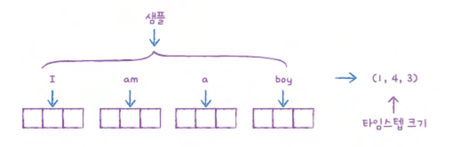
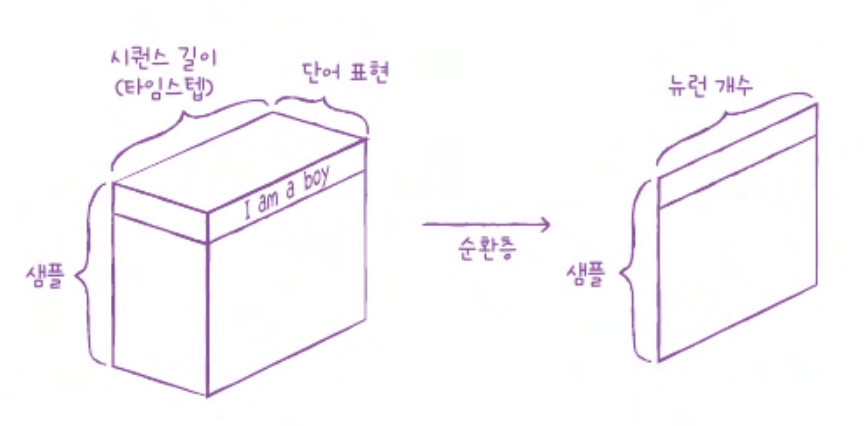
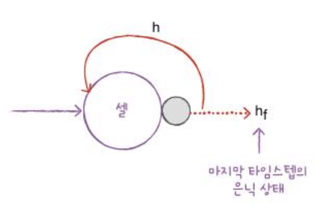
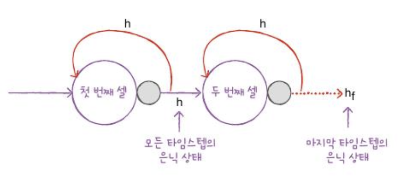
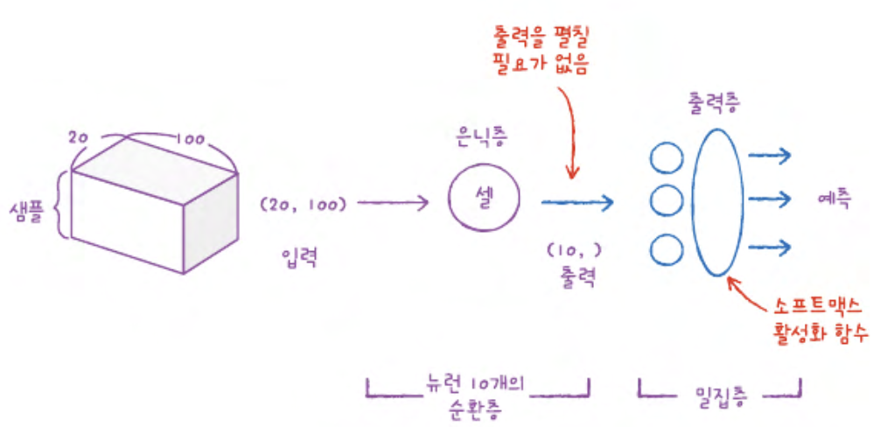

# CH09
## 09-1 순차 데이터와 순환 신경망
`순차데이터` `순환 신경망` `셀` `은닉 상태`
### 순차 데이터
- 순차 데이터: 텍스트나 시계열 데이터와 같이 순서에 의미가 있는 데이터   
  순서를 유지 하며 신경망을 주입 해야 한다   
 
- 피드 포워드 신경망: 입력 데이터 흐름이 앞으로만 전달 되는 신경망(완전 연결 신경망, 합성곱 신경망)   
   
- 순환 신경망: 다음 샘플을 위해서 이전 데이터가 신경망 층에 순환 되는 신경망   

### 순환 신경망
완전 연결신경 방에 이전 데이터의 처리 흐름을 순환 하는 고리를 추가한다   
어떤 샘플을 처리할 때 바로 이전에 사용했던 데이터를 재사용함   
   
이전 샘플에 대한 기억을 가지고 있다

- 타임 스텝: 샘플을 처리하는 한 단계
  순환신경망은 이전 타임 스텝의 샘플을 기억 하지만 타임 스텝이 오래 될수록 순환 되는 정보는 희미해진다
- 셀:순환신경 에서의 층   
- 은닉 상태: 셀의 출력   
   

은닉층의 활성화 함수로는 tanh(S자 모양을 띔)가 많이 사용됨   
   

순환 신경망에도 활성화 함수가 반드시 필요함   
이전 타임 스텝의 은닉 상태의 곱해 지는 가중치가 있음   

- 셀을 타임 스텝으로 펼치기   
     
### 셀의 가중치와 입출력
예: 순환층에 입력 되는 특성에 개수가 4 개이고 순환층의 뉴런이 3개 라고 가정

- 가중치: 4*3 = 12   
     
- 순환 층에서 다음 타임 스텝에 사용되는 은닉 상태를 위한 가중치: 3*3 = 9   
    
- 모델 파라미터 수: wx + wh + 절편 = 12 + 9 + 3 = 24

- 순환층의 입력은 일반적으로 2차원 배열(시퀀스 길이 × 특성 수)로 구성된 시퀀스 데이터이다   
예: `"I am a boy"` → 단어 수 4, 각 단어를 3차원 벡터로 표현할 경우 → (4, 3) 형태   
     
  이런 입력이 순환층을 통과하면 두번째, 세번째 차원이 사라지고 순환층의 뉴런 개수만큼 출력됨   
     

- 순환층의 출력은 마지막 타임스텝의 은닉 상태 하나만 출력된다   
  모든 타임스텝에서 은닉 상태를 생성하지만, 기본적으로 마지막 것만 외부로 출력한다   
     
  위 그림에서 점선은 모든 타임스텝의 출력을 나타내며, 실제 출력은 마지막(`f`) 은닉 상태만 사용됨

- 입력된 시퀀스를 읽고, 정보를 마지막 은닉 상태 하나에 압축하여 전달하는 구조   
  → 순환 신경망이 메모리(기억 능력) 를 가진다고 표현

- 순환 신경망도 여러 층으로 쌓을 수 있음   
  이때 하위 순환층은 모든 타임스텝의 은닉 상태를 상위 층으로 전달해야 한다   
  상위 순환층에서는 마지막 타임스텝의 은닉 상태만 출력 가능   
     

- 출력층: 마지막에 밀집층을 두어 클래스 분류
    - 다중분류일 경우 출력층에 클래수 개수만큼 뉴런을 두고 소프트맥스 함수 사용
    - 이진분류일 경우 하나의 뉴런을 두고 시그모이드 활성화 함수 사용
    

### 확인 문제
1. 다음 중 순차 데이터로 처리하기 어려운 작업은?
   >1번. 환자의 검사 결과를 바탕으로 질병 예측하기
2. 순환 신경망에서 순환층을 부르는 다른 말과, 순환층의 출력을 나타내는 용어를 올바르게 짝지은 것은 무엇인가요?
   >4번. 셀(cell) - 은닉 상태
3. 순환 신경망에서 한 셀에 있는 뉴런의 개수가 10개입니다. 이 셀의 은닉 상태가 다음 타임스텝에 사용될 때 곱해지는 가중치 wh의 크기는 얼마인가요?
   >2번. (10, 10) =  (셀의 뉴런 개수, 셀의 뉴런 개수)
