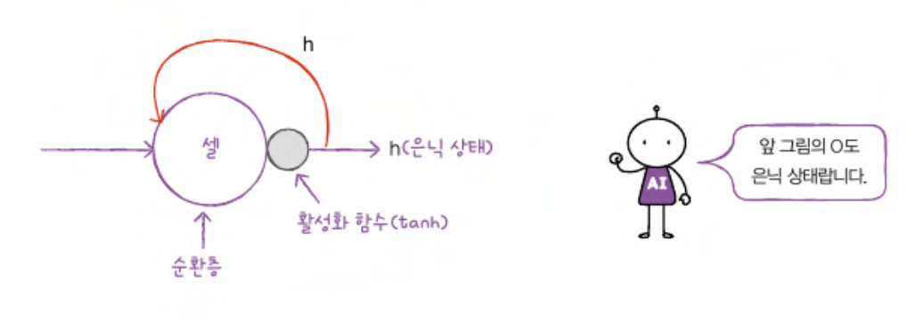

# CH09
## 09-1 순차 데이터와 순환 신경망
`순차데이터` `순환 신경망` `셀` `은닉 상태`
### 순차 데이터
순차 데이터: 텍스트나 시계열 데이터와 같이 순서에 의미가 있는 데이터
순서를 유지 하며 신경망을 주입 해야 한다   
 
피드 포워드 신경망: 입력 데이터 흐름이 앞으로만 전달 되는 신경망(완전 연결 신경망, 합성곱 신경망)   

순환 신경망: 다음 샘플을 위해서 이전 데이터가 신경망 층에 순환 되는 신경망   

### 순환 신경망
완전 연결신경 방에 이전 데이터의 처리 흐름을 순환 하는 고리를 추가 한다
어떤 샘플을 처리할 때 바로 이전에 사용했던 데이터를 재사용함

이전 샘플에 대한 기억을 가지고 있다

타임 스텝: 샘플을 처리하는 한 단계
순환신경망은 이전 타임 스텝의 샘플을 기억 하지만 타임 스텝이 오래 될수록 순환 되는 정보는 희미해진 다
셀:순환신경 에서의 층
은닉 상태: 셀의 출력

언니 층의 활성화 함수로는 tanh가 많이 사용됨
S자 모양을 띔

순환 신경망에도 활성화 함수가 반드시 필요함

이전 타임 스텝의 은닉 상태의 곱해 지는 가중치가 있음

셀을 타임 스텝으로 펼치기

### 셀의 가중치와 입출력
순환층에 입력 되는 특성에 개수가 4 개이고 순환층의 뉴런이 3개 라고 가정
가중치: 4*3 = 12   
   
순환 층에서 다음 타임 스텝에 사용되는 은닉 상태를 위한 가중치: 3*3 = 9   
   
모델 파라미터 수: wx+wb+절편 = 12+9+3=24

### 순환 신경망으로 순환 데이터 처리
### 확인 문제
