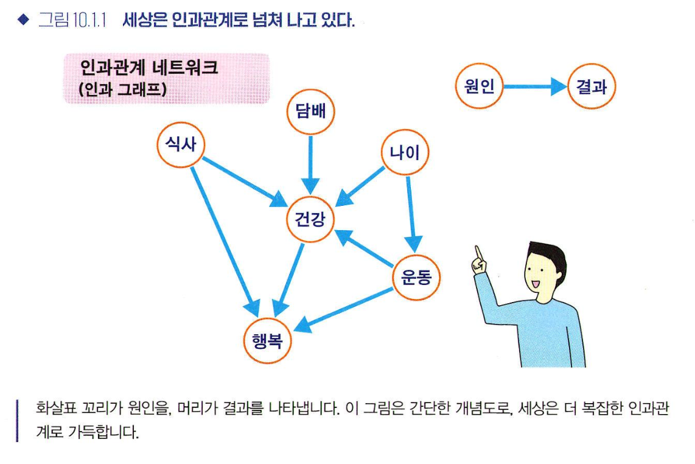

# 10. 인과와 상관
## 10.1 인과와 상관
### 인과관계 밝히기
- 인과그래프
    - 인과관계를 이해하는 것은 곧 세상의 구조를 이해하는 것이나 쉽지 않음
    

### 인과관계와 상관관계
- 인과관계: 원인과 결과의 관계(원인 → 결과)
- 상관관계: 데이터에서 보이는 관련성
    - 어떤 특정한 조합이 일어나기 쉽다
    - 확률변수 사이가 독립적이 아니다
- 중첩: 두 변수에 관련된 외부 변수, 그 변수를 **중첩요인**이라 함
    - 중첩 요인을 고려해 알고자 하는 변수의 인과효과 크기를 평가할 수 있음
- 인과관계를 밝히는 것이 중요한 이유
    - 인과관계를 알면 상관관계를 알 때보다 더 많은 것을 이해할 수 있다
    - 원인 변수를 변화시킴으로써(개입), 결과 변수를 바꿀 수 있다
- 상관관계를 밝히는 것이 중요한 이유
    - 한쪽 변수로부터 또 다른 변수를 예측할 수 있다
    - 인과관계를 명확하게 하기 전 단계로서 상관관계를 이용하여 인과와 관련된 변수 후보를 압축할 수 있다

### 허위상관
- 허위상관: 인과관계는 없지만 상관관계가 있는 경우
    - **상관이 반드시 인과를 의미하지는 않는다는 것을 기억하자**
- 허위상관의 예
    - **아이스크림 매출과 수영장 익사 사고에 양의 상관이 있다?**
        - 아이스크림이 많이 팔린다고해서 익사사고가 증가하거나 익사사고가 증가한다고 해서 아이스크림이 많이 팔리지 않는다.
        - 여기서는 중첩요인인 기온이 각각에 영향을 준다
        - 인과는 없지만 상관관계가 있기 때문에 아이스크림의 매출을 보고 익사사고 수를 어느정도 예측할 수는 있음
    - **초콜릿 소비량이 많을수록 노벨상을 많이 받는다?**
        - GDP가 중첩 요인으로 작용히여 GDP가 높을수록 초콜릿 소비량이 늘어나고, 연구에 많은 투자가 이루어져 노벨상이 증가할 가능성이 크다
- 시간 요인은 중첩되기 쉬우므로 항상 주의 깊게 살펴봐야 한다
- 수많은 변수를 마구잡이로 해석하면 우연히 생긴 상관으로 유의미한 결과를 얻을수도 있지만 새로이 얻을 데이터를 예측할 수는 없다는 점을 유의하자

## 10.2 무작위 통제 실험
### 무작위 통제 실험
- 알고자 하는 요인인 변수 X에 표본을 무작위로 할당하고 개입 실험을 수행한 다음, 변수 Y와 비교하는 방법
- 중첩요인을 확인하지 않더라도, 그 효과를 무작위를 이용하여 무효화할 수 있으므로 알고자 하는 변수의 효과만 추정이 가능해 인과효과를 추정하는 강력한 방법이 될 수 있다
- 선택평향: 관측 가능한 𝝉'는 원래 알고자 하는 효과 𝝉에 편향이 더해진 값이 된다

**중첩요인의 존재가 선택편향을 발생시켰기 때문에 인과관계를 밝혀내기 어려움**

## 10.3 통계적 인과 추론
### 인과효과를 추정하는 또 다른 방법
- 다중회귀: 원인변수를 x, 결과 변수를 반응변수 y로 하고, 여기에 중첩요인인 z를 설명변수로 추가하여 다음과 같이 다중회귀 모양을 만든다
    - $$ y = a + b_1 x + b_2 z$$
    - 중첩요인을 측정해 모형에 도입하는 것이 중요
- 층별해석: 중첩요인을 기준으로 데이터를 몇 가지 그룹으로 나누어, 각 층 안에서 중첩요인의 효과를 가능한 작게 하는 방법
- 경험점수 짝짓기: 원인변수=0인 집단과 원인변수=1인 집단에서 비슷한 중첩요인을 가진 데이터를 골라 쌍으로 만드는 방법
- 이중차분법: 중첩 요인에 따라 인과효과의 추정이 어려울 때 시간축을 도입, 집단 간 차이에 대해 다시 한번 처리 전후의 차분을 취함으로써 인과효과를 추정할 수 있는 방법
