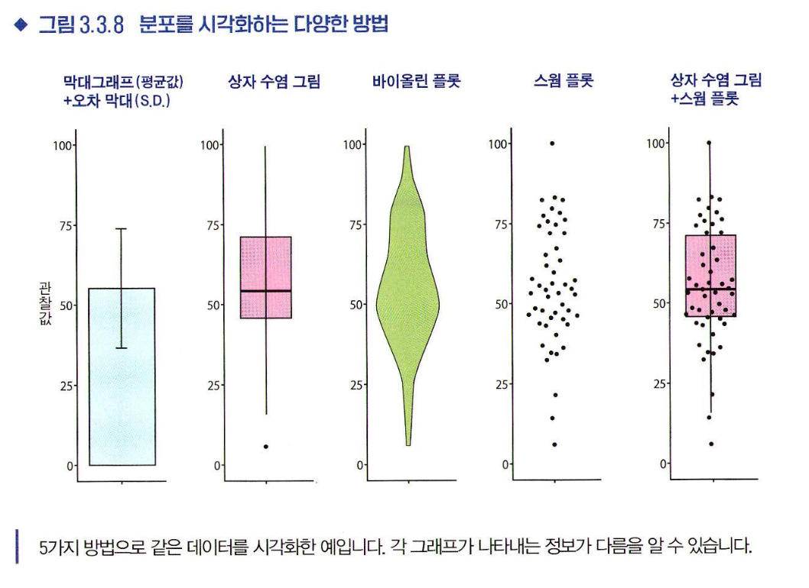

# 3장 통계분석의 기초
## 3.1 데이터 유형
* 모집단과 표본: 전수조사가 어려운 모집단 대신 모집단의 일부인 표본 조사
* 변수: 데이터 중 공통의 측정 방법으로 얻은 같은 성질의 값. '차원'이라고 표현되기도 한다. 
변수가 여러개인 경우, 변수 간의 관계를 밝히고자 데이터 분석을 할 수 있으며 예를 들어 2개의 변수를 나타내는 경우 2차원 평면상에 값을 표현할 수 있다. 변수의 갯수가 많아질수록 데이터 분석 난도가 높아진다.
* 다양한 데이터 유형
  * 양적 변수: 숫자로 나타낼 수 있는 변수. 대소 관계, 수학적 계산 가능
    * 이산형 변수: 얻을 수 잇는 값이 점점이 있는 변수
    * 연속형 변수: 간격 없이 이어지는 값으로 나타낼 수 있는 변수
  * 질적 변수: 숫자가 아닌 범주로 나타내는 변수. 대소 관계 비교, 수치 정의 불가능
    * 예: 네/아니오, 식당 메뉴 등 

## 3.2 데이터 분포
* 도수분포도(히스토그램)
  * 이산형 양적 변수의 히스토그램: 가로축-숫자, 세로축-데이터에 나타난 개수
  * 연속형 양적 변수의 히스토그램: 가로축-범위, 세로축-범위에 포함되는 숫자 개수  (범위의 넓이: 구간폭)
    구간폭을 어떻게 설정하는지에 따라 인상이 달라진다는 문제가 있어 적절한 구간폭을 결정하는 '스터지스 공식'등을 참고하되 '올바른 구간폭'이란 존재하지 않으므로 히스토그램은 대략적인 데이터 구성을 파악하는 것을 목적으로 하여 결론을 내리기 위함이 아님을 명심해야한다.
  * 범주형 변수의 히스토그램: 가로축-범주, 세로축-각 범주에 속하는 개수

## 3.3 통계량
* 통계량: 수집한 데이터로 계산을 수행하여 얻은 값.
  * 기술통계량(요약통계량): 데이터 그 자체의 성질을 기술하고 요약하는 통계량. 주로 양적 변수를 대상으로 함.
* 다양한 기술통계량
  * 대푯값: 대략적인 분포 위치, 즉 대표적인 값을 정량화하기 위해 사용하는 통계량. 매우 편리하지만 봉우리 형태가 아닌 경우 실제 데이터에서 멀리 동떨어진 값을 얻을 수도 있으므로 이 값만으로 데이터를 이해하는 것은 경계해야 한다.
    * 평균값: 가장 자주 쓰임. 표본평균이라고도 함
    * 중앙값: 크기 순으로 값을 정렬했을 때 한가운데 위치한 값. 극단적으로 크거나 작은 값에 영향을 받지 않음.
    * 최빈값: 데이터 중 가장 자주 나타나는 값. 전형적으로 나타나는 값을 파악할 때 유용함.
  * 분산과 표준편차: 데이터가 어느정도 퍼져있는지를 파악한다. 쌍봉형인 경우 분산이나 표준편차가 눈에 띄게 커진다.
    * 표본분산: 표본의 각 값과 표본평균이 어느 정도 떨어져 있는지를 평가하는 것
      * $s^2$ $\geq$ 0
      * 모든 값이 같다면 0
      * 데이터 퍼짐 정도가 크면 $s^2$이 커짐
* 상자 수염 그림: 분산을 확인할 수 있는 데이터 시각화. 중앙값, 사분위수, 최댓값, 최솟값 등의 통계량은 나타나는 반면 히스토그램에서 볼 수 있는 상세한 분포 형태 정보는 포함하지 않는다.
  * 이외에도 오차막대, 바이올린 플롯, 스웜 플롯 등 데이터 분포를 시각화 하는 다양한 방법이 있다.
    
* 이상값: 극단적으로 크거나 작은 값. 명확한 정의는 없으나, 평균값에서 표준편차의 2배-3배 이상 벗어난 숫자를 이상값으로 본다. 평균값등의 통계량에 영향을 미치므로 실수인 경우 데이터에서 제외하여 이후 분석에서 사용되지 않도록 조치를 취해야 한다.

## 3.4 확률
* 확률: 발생 여부가 불확실한 사건의 발생 가능성을 숫자로 표현한 것
  * 확률 변수: 확률이 달라지는 변수
  * 실현값: 확률변수가 실제로 취하는 값
  * 확률 분포: 가로축-확률변수, 세로축-해당 확률변수의 발생 가능성
  * 확률밀도함수: 확률변수가 연속형인 경우 값에 일정한 범위를 두고 확률을 계산하는 함수. 그 자체의 값이 아니라 상대적인 발생 가능성을 표현한 값이라는 점을 주의해야한다.
* 추론통계와 확률분포: 다루기 어려운 대상이 다룰 수 있는 대상으로 치환되는 것.
  * 기댓값: 양적 확률변수에서 변수가 확률적으로 얼마나 발생하기 쉬운가를 평균적인 값으로 나타낸 것.
  * 분산: 확률분포가 기댓값 주변에 어느 정도 퍼졌는지를 나타내는 통계량.
  * 표준편차: 분산의 제곱근을 취한 값.
  * 왜도: 분포가 좌우대칭에서 어느정도 벗어났는지를 특징짓는 값.
  * 첨도: 분포가 얼마나 뵤적한지, 그래프의 꼬리가 차지하는 비율이 얼마인지로 평가하는 값. 
* 동시확률분포: 확률변수가 2개일 때의 확률분포
  * 조건부 확률(P(X|Y)): 한쪽 확률변수의 정보가 주어졌을 때 다른 한쪽 확률변수의 확률. 독립인 경우 Y값이 어떻게 변하든 X가 발생할 확률은 변하지 않는다.
## 3.5 이론적인 확률분포
* 파라미터: 분포의 형태를 정하는 숫자
* 정규분포(가우스 분포): $N(𝜇, 𝜎^2$)로 표기. 특히 평균 𝜇=0, 표준편차 𝜎=1 인 정규분포$N(0, 1)$을 표준정규분포 라고 한다. 𝜇는 분포의 위치를, 𝜎는 분포의 넓이를 결정한다.
  * 평균을 중심으로 한 종형으로 좌우대칭 분포
  * 평균 근처에 값이 가장 많고, 평균에서 멀어질수록 적어진다.
  * 키나 몸무게 등 정규분포로 근사할 수 있는 현상이 많다.
* 표준화: $z=$ ${x-𝜇}\over 𝜎$
* 다양한 확률분포: 균등분포, 이항분포, 푸아송분포, 음이항 분포, 지수분포, 가우스 분포 등
