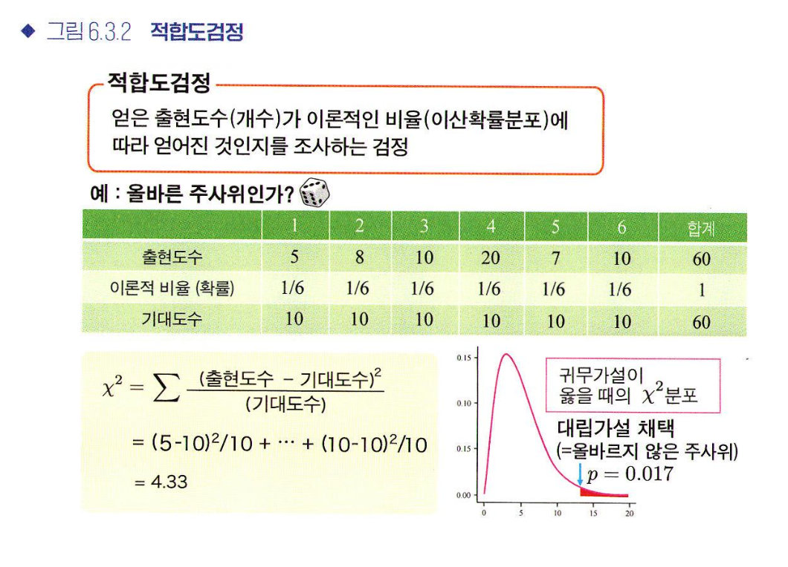

# 6장 다양한 가설검정
## 6.1 다양한 가설 검정
* 가설 검정은 다양한 목적과 가설을 대상으로 시행 가능, 해석 목적이나 데이터 성질에 따라 방법이 달라지므로 주의!
* 해석의 기본 흐름
  * 확인하고 싶은 대상에 따라 귀무가설과 대립가설을 설정한다
  * 데이터로 가설검정에 필요한 검정통계량을 계산한다
  * 귀무가설이 옳다는 가정하에 통계량의 분포를 생각하고, 데이터로 계산한 통계량이 분포의 어느 위치에 있는지를 구하여 p값을 계산한다
* 데이터 유형
  * 양적데이터인지, 질적데이터인지에 따라 해석 방법이 크게 달라지니 **데이터 유형** 먼저 확인하자
* 표본의 수
  * 1표본: 1변수 데이터 조사
  * 2표본 이상: 집단 간의 차이 조사(다중비교는 뒤에서 설명)
* 양적 변수의 성질
  * 모수 검정: 모집단이 수학적으로 다룰 수 있는 특정 분포를 따른다는 가정을 둔 가설검정
    * 정규성: 데이터가 정규분포로부터 얻어졌다고 간주할 수 있는 성질
  * 비모수 검정: 모집단분포가 특정분포라고 가정할 수 없는 경우, 평균이나 표준편차등의 파라미터(모수)에 기반을 두지 않는 가설검정
    

## 6.2 대푯값 비교
* 일표본 t검정: t검정은 표본이 하나라도 시행 가능
  * 귀무가설 "모집단의 평균은 ??이다"
  * 대립가설 "모집단의 푱균은 ??이 아니다"
  * 위의 다 가설을 전재로 검증, 유의수준 α=0.00=5, p>=0.05라면 ??이 아니다라고 말할 수 없고 p<0.05라면 모집단의 평균은 ??이 아니라고 판단 가능
    
* 이표본 t검정:
  * 귀무가설 "2개 집단의 평균값은 같다"
  * 대립가설 "2개 집단의 평균값은 다르다"
  * 분산이 일치하지 않는 경우 웰치의 t검정을 사용함
* 정규성 조사:
  * 귀무가설 "모집단이 정규분포이다"
  * 대립가설 "모집단이 정규분포가 아니다"
  * 2개 집단이 있는 경우 먼저 각 집단의 정규성을 조사하고 t검정을 시행하므로 검정 다중성 문제 발생
  * 결론적으로 데이터가 정규분포에서 얻어졌는지 여부를 조사하는 가장 좋은 방법이란 없다
* 등분산성 조사: 분산이 같다는 가설을 조사하는 검정
  * 귀무가설 "2개 모집단의 분산은 같다"
  * 대립가설 "2개 모집단의 분산은 다르다"
  * 분산이 일치하지 않는 경우 웰치의 t검정을 사용함
* 분산분석(3개 집단 이상의 평균값 비교): ANOVA 분석
  * 귀무가설 "모든 집단의 평균이 같다"
  * 대립가설 "적어도 한 쌍에는 차이가 있다"

* 분산분석의 원리
  * 집단 간 차이가 있다면 큰 데이터 퍼짐을, 없다면 집단 내 편차와 같은 정도의 작은 데이터 퍼짐을 기대
  * F분포를 따르며 F값이 p값보다 보다 오른쪽에 있다면 유의수준 p=0.05에서 통계적으로 유의미한 집단 간 차이가 있다고 판단

*다중비교 검정: 검정을 반복하는 만큼, 유의수준을 엄격한 값으로 변경하는 것
  * 집단의 수가 늘어날 수록 제1종 오류가 일어나기 쉬워짐
  * 본페로니 검정
  * 튜키 검정
  * 던넷 검정
  * 윌리엄스 검정

* 3집단 이상의 비모수검정
  * 크러스컬-윌리엄스 검정
  * 스틸-드와스 검정
  * 스틸 검정
    
## 6.3 비율 비교
* 범주형 데이터: 모집단의 파라미터가 나올 확률을 추정하거나 확률 P에 관한 가설을 세워 검정 가능
* 이항검정: 하나의 범주가 확률 P,또 하나의 범주가 확률 1-P로 나타나는지를 조사하는 검정
* 카이제곱 검정(적합도 검정): 2개 이상, 혹은 일반적인 이산확률분포에 이항검정의 방정식을 적용하고 싶으 ㄹ때 사용. 
* 카이제곱 검정(독립성 검정): 한쪽 변수의 범주가 바뀌었을 때 다른쪽 변수의 범주 비율이 달라지지 않는 경우 두 변수는 독립적
 | 
--| --|
  
