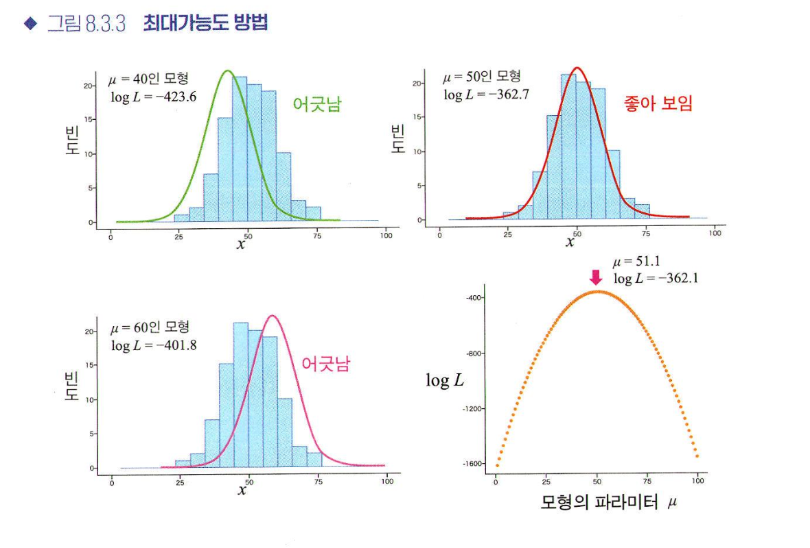
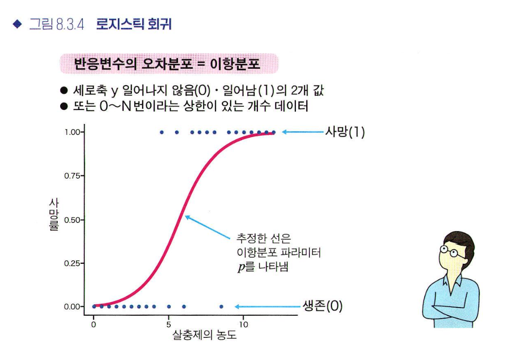
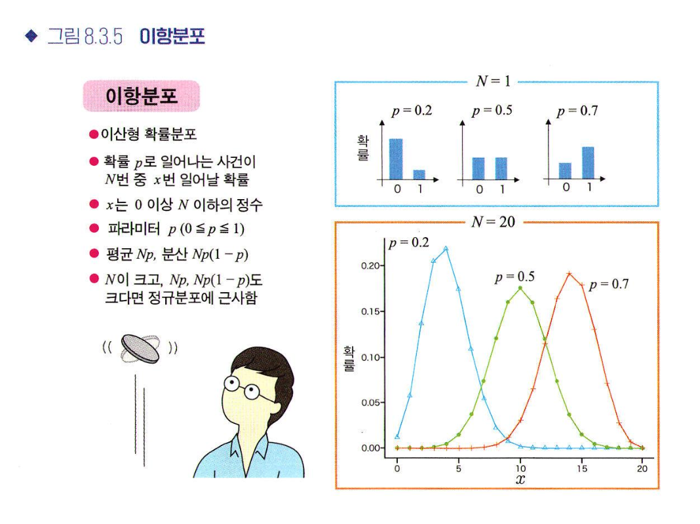
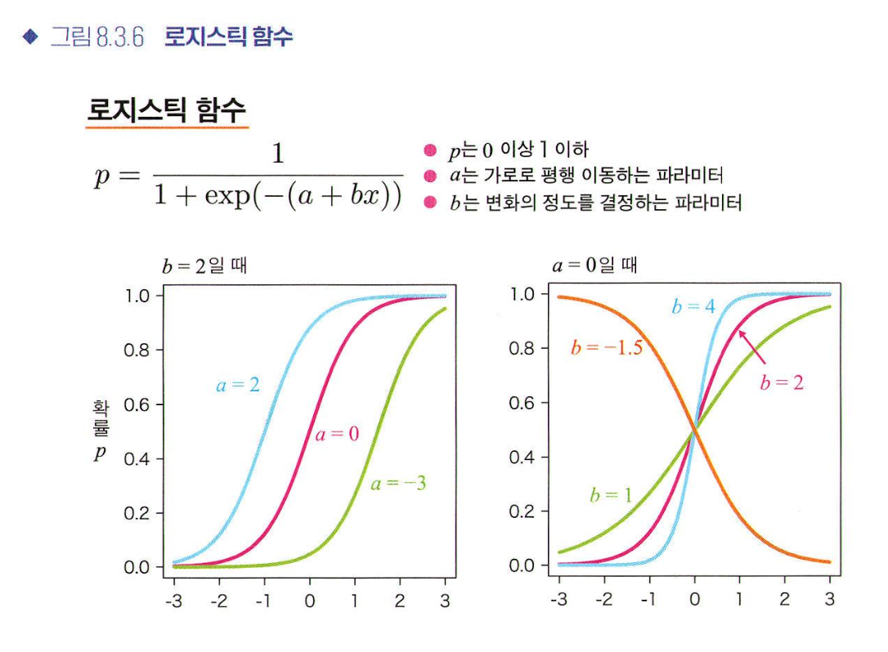
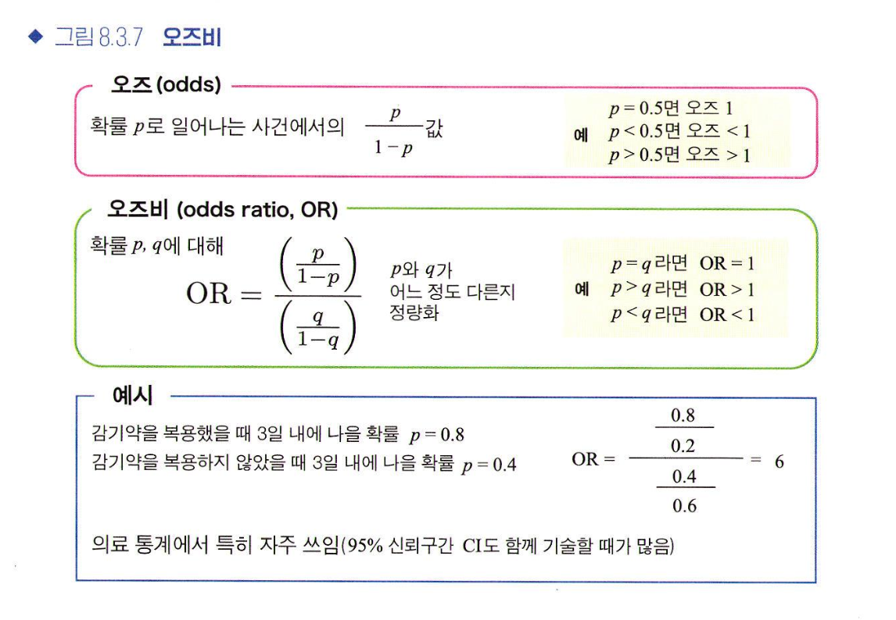
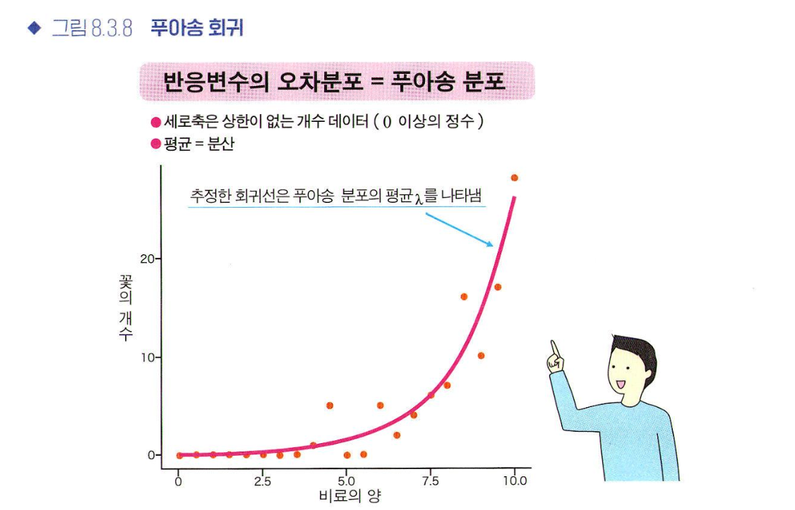
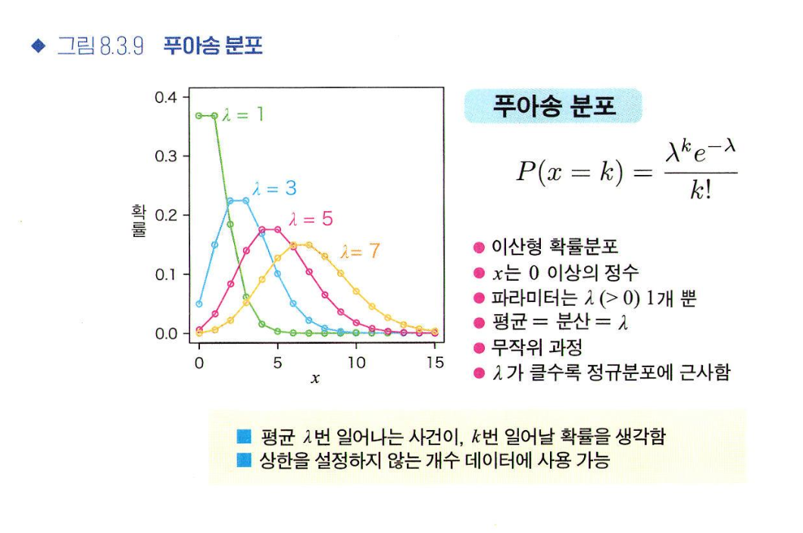

# 8. 통계 모형화
## 8.1 선형회귀 원리의 확장
실제 데이터 해석에서는 설명변수가 여러 개인 경우나 반응 변수가 범주형 변수일 수도 있어서 단순선형회귀로 표현되는 모델이 항상 적절하지는 않다

-> 다양한 데이터를 대상으로 적용 가능한 방법을 알아두자!

* 다중회귀: 설명변수가 여러 개인 것
  * 다중선형회귀모형
  
$$ y = a + b_1x_1 + ... + b_kx_k + ɛ $$
  
  * a는 절편
  * $b_1$은 $x_1$축에 대한 기울기, $b_2$는 $x_2$축에 대한 기울기
  * $b_1$, $b_2$는 편회귀계수
* 일반적인 편회귀계수를 그대로 비교할 수 없어서 표준화편회귀계수 이용
 * 회귀분석을 시행하기 전 각각의 설명 변수를 평균0, 표준편차 1로 변환한 다음 회귀분석을 시행하여 구한 회귀계수
 * 원래 데이터의 퍼짐 크기를 기준으로 편회귀계수 평가 가능
* 편회귀계수의 해석
  * $b_i$는 $x_i$ 이외의 설명 변수를 고정한채로 $x_i$가 늘어났을 때 $y$의 증가량
  * 설명변수 사이에 상관이 있는 경우 $x_i$을 움직이면 다른 설명변수도 함께 움직이므로 다중공산성이 있는지를 의심하고 이에 대처해야함
* 범주형 변수를 설명변수로
  * 범주가 2개인 경우: 0또는 1과 같은 가변수를 설명변수로 이용
  * 범주가 3개 이상인 경우: 우선 0또는 1인 가변수를 (범주개수 - 1)개 준비, {0,0,0}, {1,0,0}, {0,1,0}, {0,0,1}과 같이 범주개수 만큼을 각 범주에 할당
* 공분산분석: 일반적인 분산분석에 사용하는 데이터와 함께 양적 변수 데이터가 있는 경우에 후보가 되는 방법
  * 1. 집단 간 회귀의 기울기가 서로 다르지 않야 함
  * 2. 회귀계수가 0이 아니어야 함
* 다중공산성: 설명변수가 여러 개인 다중회귀에서 설명변수 사이에 강한 상관성이 있는 경우
  * 회귀계수의 추정오차가 커져 회귀계수를 해석하기 어려운 문제 발생
  * 예측이 목적인 회귀에서는 가능한 예측이 좋은 모형을 얻는 것이 우선이므로 회귀계수와 다중공산성이 문제가 되지 않는 경우도 흔함

## 8.2 회귀모형의 형태 바꾸기

  $$ y = a + b_1x_1 + ... + b_kx_k + ɛ $$

  상호작용: 설명 변수 간의 상승 효과 -> 곱셈으로 도입

  $$ y = a + b_1x_1 + b_2x_2 + cx_1x_2 + ɛ $$
 ```txt
 * 해석이 어려워짐
 * 상호작용항의 수가 폭발적으로 늘어남
 * 곱셈 형태로만 나타남
 * 다중공산성 문제 있음
```

과 같은 문제가 있으므로 다음과 같은 때에 한해 적용하자
 ```txt
 * 상호작용이 있다는 것이 선행 연구에서 밝혀지거나 기대되는 때
 * 데이터에 분명한 상호작용이 있을 때
 * 상호작용 유무에 관심이 있을 떄
```

* 일원배치 분산분석: 집단 간 평균을 비교하는 것과 같이 하나의 요인만 다루는 분산분석
* 다원배치 분산분석: 여러개의 요인을 동시에 고려하는 분산분석
* 비선형회귀
  * 무턱대고 복잡한 모형을 채택하는 것은 바람직하지 않음
  * 미분계수가 0이 되는 지점이 여러개일 가능성도 있으므로 국소 최적해에 빠질 위험 주의
  
## 8.3 일반화선형모형의 개념
* 일반선형모형: 설명변수가 양적변수인 다중회귀부터 설명변수가 범주형 변수인 분산분석까지를 포괄하는 구조
* 일반화선형모형: 일반선형모형을 확장하여 최소제곱법이 아닌 확률분포에 기반한 최대가능방법으로 회귀모형을 추정하는 방법
* 최대가능도 추정: 가능도를 최대화하는 θ를 찾아서 이를 추정값으로 삼아 얻은 데이터에 가장 잘 들어맞는 파라터를 정하는 것

* 로지스틱회귀: 반응변수가 값이 2개인 범주형 변수일 때 사용하는 회귀 (예/아니오, 생존/사망 등)

* 이항분포

* 로지스틱 함수

* 오즈비: 2개의 확률 p와 q에 대한 2개의 오즈 비율
  * 로지스틱 회귀의 결과를 평가하는 값
  * 통계학 전반에서 일어나기 쉬움을 비교하는 척도로 이용됨

* 푸아송 회귀: 데이터가 음수가 되지 않는 정수일 때 고려가능한 일반화선형모델
  * 푸아송분포: 낮은 확률로 일어나는 무작위 사건에 대해 평균이 λ번일 때 몇번 일어나는지를 나타내는 확률분포


## 8.4 통계 모형의 평가와 비교
* 왈드 검정
* 가능도비 검정
* 파라미터 추정량분포를 정규분포로 근사할 수 있는 단순한 모형일 때 사용하는 통계 모형 비교 방법
  * AIC: 새롭게 얻을 데이터를 얼마나 잘 예측할 수 있는지를 바탕으로 모형의 적합도를 결정하는 지표
  * BIC(베이즈 정보기준)
