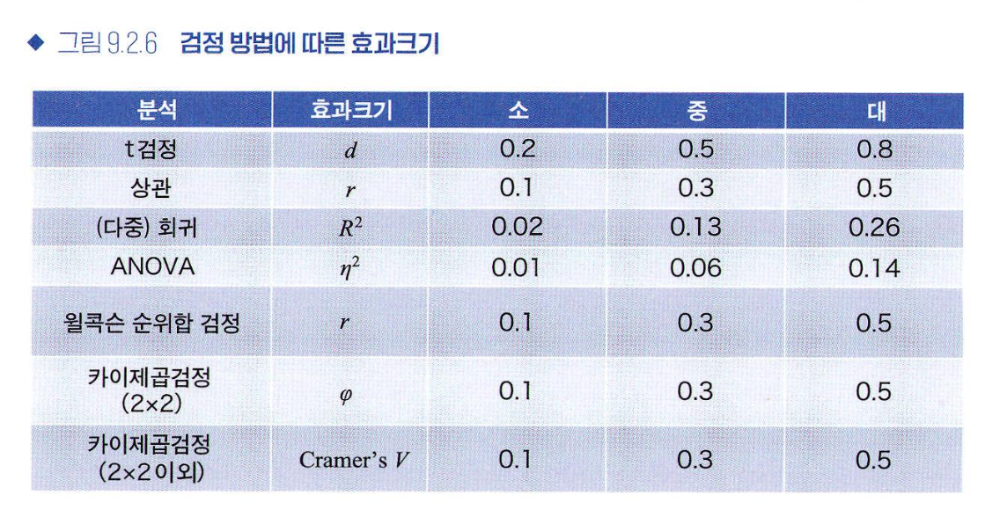
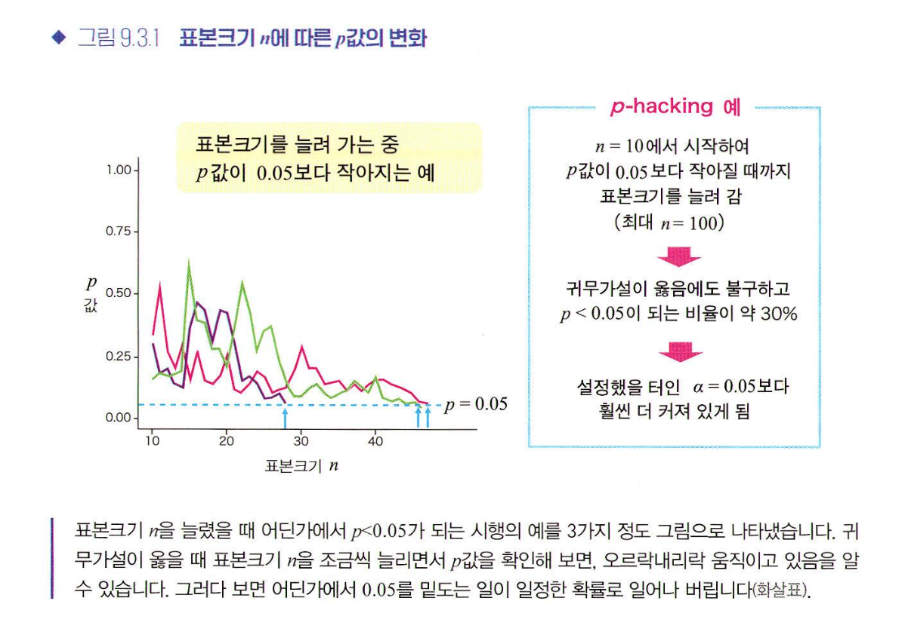
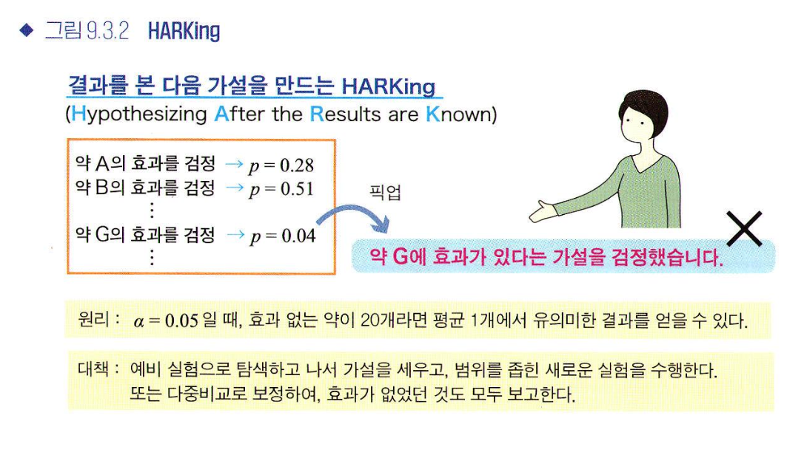

# 9. 가설검정의 주의점
## 9.1 재현성
### 재현성 위기
- p값을 둘러싼 논쟁
    - p값을 사용하지 않는 것이 좋다
    - 유의 수준 0.05를 변경하는 쪽이 좋다 등
- 재현성: 누가 언제 어디서 실험하더라도, 조건이 동일하다면 동일한 결과를 얻을 수 있어야 한다는 것. 재현성이 없다는 것은 원래 논문의 주장이 잘못되었을 가능성이 있다는 것을 의미하므로 과학에서는 중대한 문제이다.

- 재현 불가능 원인
    - 실험 조건을 동일하게 조성하기 어렵다
    - 가설검정의 사용 방법 상의 문제(p값을 0.05보다 작게 만드는 p-해킹이 가능)
**p=0.05가 절대적인 진리가 아님을 명심하자**

## 9.2 가설검정의 문제점
### p값 되돌아보기
- p값의 정의: 귀무가설이 옳다고 가정할 때 실제 관찰한 데이터 이상으로 극단적인 값을 얻을 확률
    - 값이 작으면 귀무가설과 관찰한 데이터 사이에 괴리가 크다는 것을 의미
    - 유의수준을 밑도는 때에는 귀무가설을 기각하는 판단을 내리게 된다
- 왜 α=0.05를 사용하는가
    - 근거는 없다!
    - 통계학자 로널드 피셔가 자의적임을 인정하면서도 증거의 강력함을 나타내는 지표로 사용한 것을 시작으로 현대 과학에서는 관례처럼 사용할 뿐이다
    - 그러므로 이후 동향에 따라 α값은 다른 값으로 변경될 수도 있다
### 피서류 검정 & 네이만-피어슨류 검정
- 피서류 검정: 귀무가설이 옳을 때 관찰한 데이터 이상으로 극단적인 값을 얻을 확률인 p값을 계산하고, 귀무가설과 관찰한 값의 괴리를 평가
- 네이만-피어슨류 검정: p값이 유의수준 α미만인가 이상인가에만 주목하여, 가설 기각/채택이라는 결론을 내림
    - 미리 검출하고자하는 효과크기를 정하고, 설정한 α와 β에 따라 필요한 표본크기 n을 결정해야 함
- 표본 크기: 표본 크기에 따라 가설검정의 결과가 달라질 수 있다. 표본크기가 커지면 p값은 작아지므로 검출하고자 하는 효과크기를 사전에 설정하고 표본크기를 설계해야 함
    - p<0.05에만 관심을 두는 것이 아니라 효과크기나 신뢰구간을 나타내는 것도 중요하다. 표본크기가 너무 크면 좋지 않다고 생각할 수 있으나 큰 표본크기는 신뢰구간을 좁혀 한층 더 신뢰 가능한 추정값을 얻을 수 있다는 장점도 있다는 것을 알아두자.
### 효과 크기
- 효과크기: 얼마만큼의 효과가 있는지 나타내는 것
    - 메타 분석(어떤 현상을 보고한 여러 논문을 통합하여, 결과를 종합적으로 평가하는 방법)에서 중요
    
### 베이즈인수
- 베이즈 인수: p값의 문제 해결책 중 하나로 사용 가능
    - 2가지 가설을 대등하게 비교 가능
    - 귀무가설 지지 가능
    - 순차적 갱신 가능 등
    - 주의점 
        - 두 가설의 상대적인 비교이므로 한쪽 가설이 나쁜것만으로 인수가 큰 값이 될 수 있다. 그러므로 사후예측점검 수행이 필요하다
        - 파라미터 θ의 사전분포에 영향을 받는다
        - 주변가능도를 구할 때 모형으로 설정한 파라미터로 평균화하기 위한 적분 계산이 필요하다.
사람들에게 강한 인상을 줄 만한 예상 외면서 좋은 가설을 세워 검증하는 것이 연구자의 실력을 판가름한다
## 9.3 해킹
### p-해킹
- p해킹: 의도하든, 의도하지 않든 p값을 원하는 방향으로 조작하는 행위
    - 결과를 보며 표본크기를 늘려서는 안 됨
    
    - 마음에 드는 해석만 보고해서는 안 됨
    
### p해킹을 예방하기 위한 노력
- 가설검증형 연구와 탐색형 연구
- 사전등록: 연구를 실시하기 전에 가설과 실험 설계, 분석 방법 등의 연구 계획을 등록하는 것
- p값 관련 문제 정의
    - p값을 제대로 이해하고 사용한다
    - 가설검정을 반복하면 다중성 문제가 발생하고, 위양성이 증가한다는 것을 이해한다
    - 탐색형 연구와 가설검증형 연구의 차이를 이해한다
    - 실시한 실험이나 해석은 제대로 보고한다
    - 재현성이 있는지 염두에 둔다. 가능하다면 재실험하여 확인한다
    - 좋은 가설을 세운다
